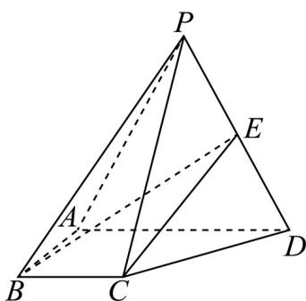

<!-- question-source:start -->
18. 如图，在四棱锥 $P - ABCD$ 中， $\triangle PAD$ 是边长为 $4$ 的等边三角形，底面 $ABCD$ 为直角梯形， $BC \parallel AD$

$AB \perp AD$ ，BC = AB = 2，E 为 PD 的中点·

(1)求证： $CE \parallel$ 平面PAB；

(2)当平面 $PAD \perp$ 平面ABCD时，求直线BE与平面PCD所成角的正弦值.
<!-- question-source:end -->

![[高中/课堂同步/题库/人教A版高中数学同步讲义(2026)/03_选择性必修第一册/第一章 空间向量与立体几何/阶段测试/第一章_空间向量与立体几何_高效培优单元测试_强化卷_/三_填空题_sec_04/questions/answers/Q00062907A1.md]]
