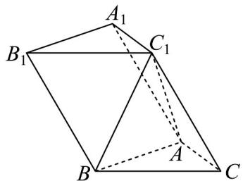

<!-- question-source:start -->
19. 如图，在三棱柱 $ABC - A_{1}B_{1}C_{1}$ 中， $AC = AB = 2$ ， $BC = 2\sqrt{2}$ ， $AC \perp BC_{1}$

(1)证明： $AC \perp$ 平面 $ABC_{1}$ ；

(2)若 $CC_{1} = 2\sqrt{2}$ ，二面角 $C_1 - AC - B$ 的大小为 $60^{\circ}$ ，求直线 $BC_{1}$ 与平面 $AA_{1}B_{1}B$ 所成角的正弦值.
<!-- question-source:end -->

![[高中/课堂同步/题库/人教A版高中数学同步讲义(2026)/03_选择性必修第一册/第一章 空间向量与立体几何/阶段测试/第一章_空间向量与立体几何_高效培优单元测试_强化卷_/三_填空题_sec_04/questions/answers/Q00062908A1.md]]
