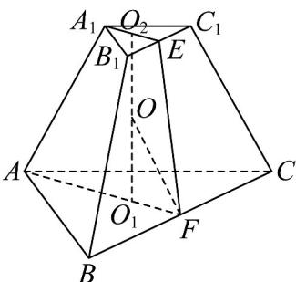

> [!faq]- 《第一章_空间向量与立体几何_高效培优单元测试_强化卷_》官方解析
>
> > [!success]- **【答案】** $\frac{3\pi}{2} / \frac{3}{2}\pi$
>
> > [!note]- **【分析】**
> > 取 $B_{1}C_{1}$ 的中点为 $E$ ， $BC$ 的中点为 $F$ ，连接 $A_{1}E, AF, EF$ ，在平面 $A_{1}AFE$ 中，过 $F$ 作 $\mathsf{DEFA}$ 平分线，
> >
> > 交 $O_{1}O_{2}$ 于 $O$ ，则 $O$ 到底面及三个侧面的距离相等，求出 $OO_{1} = \frac{\sqrt{6}}{2}$ 结合体高可求该棱台内最大的球的球的
> >
> > 半径，故可求对应的表面积·
>
> > [!note]- **【解析】**
> > 取 $B_{1}C_{1}$ 的中点为E，BC的中点为F，连接 $A_{1}E,AF,EF$ ，
> >
> > $EF=\sqrt{16-\left(\frac{6-2}{2}\right)^{2}}=2\sqrt{3}$ 且上底面中心 $O_{2}$ 在线段 $A_{1}E$ 上，
> >
> > 且 $O_{2}E = \frac{1}{3}\times \frac{\sqrt{3}}{2}\times 2 = \frac{\sqrt{3}}{3}$ ，同理 $O_{1}F = \sqrt{3}$
> >
> > 而 $O_{1}O_{2}$ 垂直于上下底面，且 $A_{1}E$ 在上底面中，AF 在下底面中，
> >
> > 故 $O_{1}O_{2}\perp A_{1}E,O_{1}O_{2}\perp AF$ ，故 $O_{2}O_{1} = \sqrt{12 - \left(\sqrt{3} -\frac{\sqrt{3}}{3}\right)^{2}} = \frac{4\sqrt{6}}{3}$
> >
> > 在平面 $A_{1}AFE$ 中，过 F 作 DEFA 平分线，交 $O_{1}O_{2}$ 于 O，
> >
> > 则 O 到底面及三个侧面的距离相等.
> >
> > 又 $\tan \angle EFA = \frac{\frac{4\sqrt{6}}{3}}{\frac{2\sqrt{3}}{3}} = 2\sqrt{2}$ ，故 $2\sqrt{2} = \frac{2\tan\angle OFA}{1 - \tan^2\angle OFA}$
> >
> > 故 $\tan \angle OFA = \frac{\sqrt{2}}{2}$ （负解舍去），故 $OO_{1} = \sqrt{3} \times \frac{\sqrt{2}}{2} = \frac{\sqrt{6}}{2}$
> >
> > 由正三棱台的对称性可知棱台内最大的球要么与上下底面相切，
> >
> > 要么与底面及 $^{3}$ 个侧面相切，而 $\frac{\sqrt{6}}{2}<\frac{1}{2}\times\frac{4\sqrt{6}}{3}$
> >
> > 故棱台内最大的球与底面及 $^{3}$ 个侧面相切，且球的半径为 $\frac{\sqrt{6}}{2}$
> >
> > 
> >
> > 故所得的截面面积为 $\pi \times \left( \frac{\sqrt{6}}{2} \right)^{2} = \frac{3\pi}{2}$ .
> >
> > 故答案为： $\frac{3\pi}{2}$
> >
> > 四、解答题：本题共5小题，共77分。解答应写出文字说明、证明过程或演算步骤。
