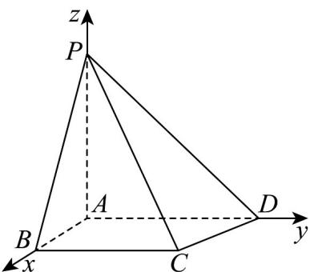
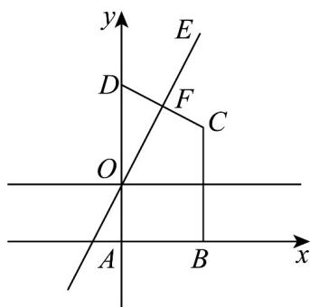
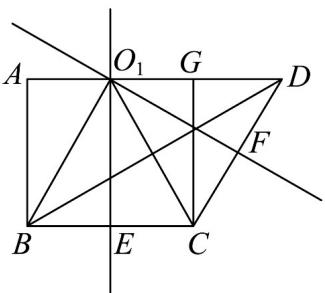
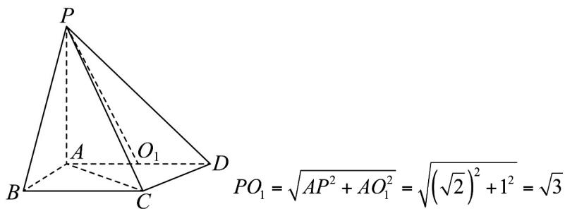
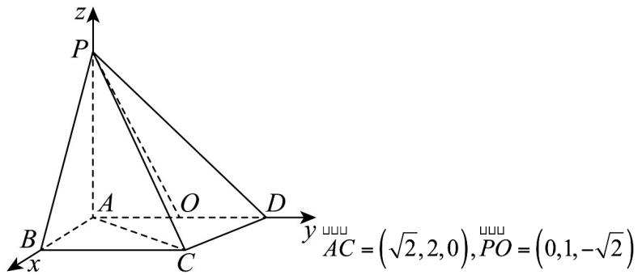
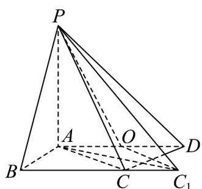

> [!faq]- 《第一章_空间向量与立体几何_高效培优单元测试_强化卷_》官方解析
>
> > [!success]- **【答案】** (1)证明见解析； (2) (i) 证明见解析； (ii) $\frac{\sqrt{2}}{3}$ .
>
> > [!note]- **【分析】**
> > （1）通过证明 $AP \perp AB$ ， $AP \perp AD$ ，得出 $AB \perp$ 平面 PAD，即可证明面面垂直；
> >
> > (2) (i) 法一：建立空间直角坐标系并表达出各点的坐标，假设 P, B, C, D 在同一球面上，在平面 xAy
> >
> > 中，得出点 $O$ 坐标，进而得出点 $O$ 在空间中的坐标，计算出 $\left|OP\right| = \left|OB\right| = \left|OC\right| = \left|OD\right|$ ，即可证明结论；
> >
> > 法二：作出 $\triangle BCD$ 的边 $BC$ 和 $CD$ 的垂直平分线，找到三角形的外心 $O_{1}$ ，求出 $PO_{1}$ ，求出出外心 $O_{1}$ 到 $P$ ，
> >
> > $B$ ， $C$ ， $D$ 的距离相等，得出外心 $O_{1}$ 即为 $P$ ， $B$ ， $C$ ， $D$ 所在球的球心，即可证明结论；
> >
> > (ii) 法一：写出直线 AC 和 PO 的方向向量，即可求出余弦值.
> >
> > 法二：求出 AC 的长，过点 O 作 AC 的平行线，交 BC 的延长线为 $C_{1}$ ，连接 $AC_{1}$ ， $PC_{1}$ ，利用勾股定理求出
> >
> > $AC_{1}$ 的长，进而得出 $PC_{1}$ 的长，在 $\triangle POC_{1}$ 中由余弦定理求出 $\cos\angle POC_{1}$ ，即可求出直线 AC 与直线 PO 所成
> >
> > 角的余弦值·
>
> > [!note]- **【解析】**
> > （ $^{1}$ ）由题意证明如下，
> >
> > 在四棱锥 P-ABCD 中， $PA \perp$ 平面 ABCD ， $AB \perp AD$ ，
> >
> > $AB \subset$ 平面 $ABCD$ ， $AD \subset$ 平面 $ABCD$ ，
> >
> > $\therefore AP \perp AB, AP \perp AD$
> >
> > ∵AP⊂平面PAD，AD⊂平面PAD，AP∩AD=A
> >
> > $\therefore AB \perp$ 平面 PAD ，
> >
> > ∵ AB ⊂ 平面 PAB ，
> >
> > ∴平面 $PAB \perp$ 平面 PAD·
> >
> > $^{(2)}$ $^{(i)}$ 由题意及 $^{(1)}$ 证明如下，
> >
> > 法一：
> >
> > 在四棱锥 P-ABCD 中， $AP \perp AB$ ， $AP \perp AD$ ， $AB \perp AD$ ， $BC \parallel AD$ ，
> >
> > $$
> > P A = A B = \sqrt {2} \quad A D = 1 + \sqrt {3}
> > $$
> >
> > 建立空间直角坐标系如下图所示，
> >
> > 
> >
> > $A(0,0,0),B(\sqrt{2},0,0),C(\sqrt{2},2,0),D(0,1 + \sqrt{3},0),P(0,0,\sqrt{2})$
> >
> > 若 P, B, C, D 在同一个球面上，
> >
> > 则 $\left|OP\right|=\left|OB\right|=\left|OC\right|=\left|OD\right|$
> >
> > 在平面 $xAy$ 中，
> >
> > 
> >
> > $$
> > A (0, 0), B (\sqrt {2}, 0), C (\sqrt {2}, 2), D (0, 1 + \sqrt {3})
> > $$
> >
> > :线段 CD 中点坐标 $F\left(\frac{\sqrt{2}}{2}, \frac{\sqrt{3} + 3}{2}\right)$
> >
> > 直线 $CD$ 的斜率： $k_{1} = \frac{1 + \sqrt{3} - 2}{0 - \sqrt{2}} = -\frac{\sqrt{3} - 1}{\sqrt{2}}$
> >
> > 直线 $CD$ 的垂直平分线 $EF$ 斜率： $k_{2} = \frac{\sqrt{2}}{\sqrt{3} - 1} = \frac{\sqrt{6} + \sqrt{2}}{2}$
> >
> > ∴直线 $EF$ 的方程： $y - \frac{\sqrt{3} + 3}{2} = \frac{\sqrt{6} + \sqrt{2}}{2}\left(x - \frac{\sqrt{2}}{2}\right)$
> >
> > 即 $y=\frac{\sqrt{6}+\sqrt{2}}{2}\left(x-\frac{\sqrt{2}}{2}\right)+\frac{\sqrt{3}+3}{2}$ ，
> >
> > 当 y=1 时， $1=\frac{\sqrt{6}+\sqrt{2}}{2}\left(x_{o}-\frac{\sqrt{2}}{2}\right)+\frac{\sqrt{3}+3}{2}$ ，解得： $x_{o}=0$ ，
> >
> > $O(0,1)$
> >
> > 在立体几何中， $O(0,1,0)$
> >
> > $$
> > \because \left\{ \begin{array}{l} | O P | = \sqrt {0 ^ {2} + 1 ^ {2} + (0 - \sqrt {2}) ^ {2}} \\ | O B | = \sqrt {(0 - \sqrt {2}) ^ {2} + 1 ^ {2} + 0 ^ {2}} \\ | O C | = \sqrt {(0 - \sqrt {2}) ^ {2} + (1 - 2) ^ {2} + 0 ^ {2}} \\ | O D | = \sqrt {0 ^ {2} + (1 - 1 - \sqrt {3}) ^ {2} + 0 ^ {2}} \end{array} \right.
> > $$
> >
> > 解得： $\left|OP\right|=\left|OB\right|=\left|OC\right|=\left|OD\right|=\sqrt{3}$
> >
> > ∴点 O 在平面 ABCD 上.
> >
> > 法二：
> >
> > ∵P，B，C，D在同一个球面上，
> >
> > ∴球心到四个点的距离相等
> >
> > 在 $\triangle BCD$ 中，到三角形三点距离相等的点是该三角形的外心，
> >
> > 作出 BC 和 CD 的垂直平分线，如下图所示，
> >
> > 
> >
> > 由几何知识得，
> >
> > $$
> > O _ {1} E = A B = \sqrt {2}, B E = C E = A O _ {1} = G O _ {1} = \frac {1}{2} B C = 1, O _ {1} D = A D - A O _ {1} = \sqrt {3}
> > $$
> >
> > $$
> > B O _ {1} = C O _ {1} = \sqrt {1 ^ {2} + (\sqrt {2}) ^ {2}} = \sqrt {3}
> > $$
> >
> > $$
> > O _ {1} D = B O _ {1} = C O _ {1}
> > $$
> >
> > ∴点 $O_{1}$ 是 $\triangle BCD$ 的外心，
> >
> > 在 Rt△AOP 中，AP⊥AD，AP= $\sqrt{2}$
> >
> > 由勾股定理得，
> >
> > 
> >
> > $$
> > \therefore P O _ {1} = B O _ {1} = C O _ {1} = O _ {1} D = \sqrt {3}
> > $$
> >
> > ∴点 $O_{1}$ 即为点 P，B，C，D 所在球的球心 O，
> >
> > 此时点 O 在线段 AD 上， $AD \subset$ 平面 ABCD
> >
> > ∴点 O 在平面 ABCD 上.
> >
> > (ii) 由题意，(1)(2)(ii) 及图得，
> >
> > 
> >
> > 设直线 AC 与直线 PO 所成角为 $\theta$ ，
> >
> > $$
> > \cos \theta = \frac {\left| A C \cdot P Q \right|}{\left| A C \right| \left| P O \right|} = \frac {\left| 0 + 2 \times 1 + 0 \right|}{\sqrt {(\sqrt {2}) ^ {2} + 2 ^ {2} + 0} \times \sqrt {0 + 1 ^ {2} + (- \sqrt {2}) ^ {2}}} = \frac {\sqrt {2}}{3}.
> > $$
> >
> > 法2：
> >
> > 由几何知识得， $PO = \sqrt{3}$
> >
> > $$
> > A B \perp A D, B C A D
> > $$
> >
> > $$
> > \therefore A B \perp B C
> > $$
> >
> > 在 RtVABC 中， $AB = \sqrt{2}$ ，BC = 2，由勾股定理得，
> >
> > $$
> > A C = \sqrt {A B ^ {2} + B C ^ {2}} = \sqrt {\left(\sqrt {2}\right) ^ {2} + 2 ^ {2}} = \sqrt {6}
> > $$
> >
> > 过点 $O$ 作 $AC$ 的平行线，交 $BC$ 的延长线为 $C_1$ ，连接 $AC_1$ ， $PC_1$
> >
> > 
> >
> > 则 $OC_{1} = AC = \sqrt{6}$ ，直线 $AC$ 与直线 $PO$ 所成角即为 $\triangle POC_{1}$ 中 $\angle POC_{1}$ 或其补角·
> >
> > ∵ PA ⊥ 平面 ABCD ， $AC_{1} \subset$ 平面 ABCD ， $PA \cap AC_{1} = A$
> >
> > $PA \perp AC_{1}$
> >
> > 在 Rt△ABC₁ 中， $AB=\sqrt{2}$ ， $BC_{1}=BC+CC_{1}=2+1=3$ ，由勾股定理得，
> >
> > $$
> > A C _ {1} = \sqrt {A B ^ {2} + B C _ {1} ^ {2}} = \sqrt {\left(\sqrt {2}\right) ^ {2} + 3 ^ {2}} = \sqrt {1 1}
> > $$
> >
> > 在 Rt△APC $_{1}$ 中，PA = √2 ，由勾股定理得，
> >
> > $$
> > P C _ {1} = \sqrt {P A ^ {2} + A C _ {1} ^ {2}} = \sqrt {\left(\sqrt {2}\right) ^ {2} + \left(\sqrt {1 1}\right) ^ {2}} = \sqrt {1 3},
> > $$
> >
> > 在 $^{\triangle}POC_{1}$ 中，由余弦定理得，
> >
> > $$
> > P C _ {1} ^ {2} = P O ^ {2} + O C _ {1} ^ {2} - 2 P O \cdot O C _ {1} \cos \angle P O C _ {1}
> > $$
> >
> > 即： $\left(\sqrt{13}\right)^2 = \left(\sqrt{3}\right)^2 +\left(\sqrt{6}\right)^2 -2\sqrt{3}\times \sqrt{6}\cos \angle POC_1$
> >
> > 解得： $\cos \angle POC_{1} = -\frac{\sqrt{2}}{3}$
> >
> > ∴直线 AC 与直线 PO 所成角的余弦值为： $\left|\cos\angle POC_{1}\right|=\frac{\sqrt{2}}{3}$
