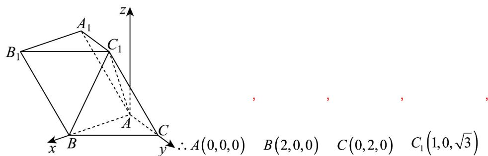

> [!faq]- 《第一章_空间向量与立体几何_高效培优单元测试_强化卷_》官方解析
>
> > [!success]- **【答案】** (1)证明见解析 (2) $\frac{\sqrt{21}}{7}$
>
> > [!note]- **【分析】**
> > （1）根据勾股定理逆定理得到 $AC \perp AB$ ，结合 $BC_{1} \stackrel{\wedge}{\sim} AC$ 即可证明出线面垂直；
> >
> > (2) 先由线面垂直得到线线垂直，得到二面角 $C_{1}-AC-B$ 的平面角为 $\angle BAC_{1}=60^{\circ}$ ，求出各边长，得到
> >
> > 
> >
> > $\triangle ABC_{1}$ 为等边三角形，建立空间直角坐标系，求出平面 $AA_{1}B_{1}B$ 的法向量，由线面角的向量公式求出答案
>
> > [!note]- **【解析】**
> > （1）∵ AC = AB = 2， $BC = 2\sqrt{2}$ ，有 $AC^{2} + AB^{2} = BC^{2}$ ，∴ $AC \perp AB$ ，
> >
> > 又∵ $AC \perp BC_{1}$ ，ABI $BC_{1} = B$ ， $AB, BC_{1} \subset$ 平面 $ABC_{1}$
> >
> > $\therefore AC \perp_{\text{平面}} ABC_{1}$
> >
> > (2) $\because AC \perp$ 平面 $ABC_{1}$ , $C_{1}A, AB \subset$ 平面 $ABC_{1}$
> >
> > $$
> > \therefore A C \perp C _ {1} A _ {\text {且}} A C \perp A B
> > $$
> >
> > ∴ 二面角 $C_{1}-AC-B$ 的平面角为 $\angle BAC_{1}=60^{\circ}$ ，而 $CC_{1}=2\sqrt{2}$
> >
> > $\therefore AC_{1} = \sqrt{CC_{1}^{2} - AC^{2}} = \sqrt{8 - 4} = 2 = AB$ ， $\therefore \triangle ABC_{1}$ 为等边三角形，
> >
> > 以 A 为坐标原点，AB, AC 所在直线分别为 x, y 轴， $\triangle ABC_{1}$ 所在平面为 xAz 平面，
> >
> > 建立如图所示的空间直角坐标系，
> >
> > $$
> > A _ {1} C _ {1} = A C \Rightarrow A _ {1} (1, - 2, \sqrt {3}), \therefore B C _ {1} = (- 1, 0, \sqrt {3}), A B = (2, 0, 0), A A _ {1} = (1, - 2, \sqrt {3})
> > $$
> >
> > 设平面 $AA_{1}B_{1}B$ 的一个法向量 $n=(x,y,z)$
> >
> > $$
> > \therefore \left\{ \begin{array}{l} A B \cdot n = (2, 0, 0) \cdot (x, y, z) = 2 x = 0 \\ A A _ {1} \cdot n = (1, - 2, \sqrt {3}) \cdot (x, y, z) = x - 2 y + \sqrt {3} z = 0 \end{array} , \right.
> > $$
> >
> > 解得 $x = 0$ ，令 $y = \sqrt{3}$ ，则 $z = 2$ ，故 $n = (0, \sqrt{3}, 2)$
> >
> > 设 $BC_{1}$ 与平面 $AA_{1}B_{1}B$ 所成角为 $\theta$
> >
> > $$
> > \therefore \sin \theta = \frac {\left| \overrightarrow {B C _ {1}} \cdot n \right|}{\left| \overrightarrow {B C _ {1}} \right| | n |} = \frac {2 \sqrt {3}}{2 \times \sqrt {7}} = \frac {\sqrt {2 1}}{7}.
> > $$
> >
> > ∴直线 $BC_{1}$ 与平面 $AA_{1}B_{1}B$ 所成角的正弦值为 $\frac{\sqrt{21}}{7}$
