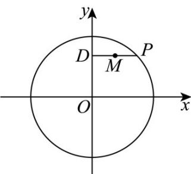

> [!faq]- 《专题01_椭圆的四大常考题型_高效培优专项训练_》官方解析
>
> > [!success]- **【答案】** A
>
> > [!note]- **【解析】**
> > 设点 $P(x_0,y_0)$ 、 $M(x,y)$ ，则 $D(0,y_0)$
> >
> > 
> >
> > 由中点的坐标公式可得 $\left\{ \begin{array}{l}x = \frac{x_0}{2}\\ y = y_0 \end{array} \right.$ ，所以， $\left\{ \begin{array}{ll}x_0 = 2x\\ y_0 = y \end{array} \right.$
> >
> > 因为点 P 在圆 O 上，则 $x_{0}^{2} + y_{0}^{2} = 4$ ，则 $(2x)^{2} + y^{2} = 4$ ，整理可得 $\frac{y^{2}}{4} + x^{2} = 1$ 。
> >
> > 因此，轨迹 $M$ 的方程为 $\frac{y^2}{4} + x^2 = 1$ .
> >
> > 故选 **A**.
