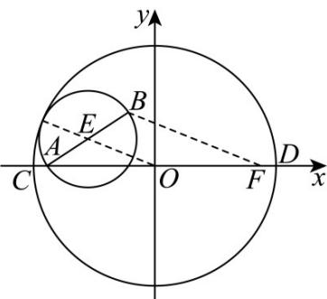

> [!faq]- 《专题01_椭圆的四大常考题型_高效培优专项训练_》官方解析
>
> > [!success]- **【答案】** 8
>
> > [!note]- **【解析】**
> > 
> >
> > 如图，设以 $AB$ 为直径的圆的圆心为 $E$ ， $F(2\sqrt{3},0)$
> >
> > 因为两圆内切，所以 $\left|OE\right|=4-\frac{1}{2}\left|BA\right|$
> >
> > 又 $OE$ 为 $\triangle ABF$ 的中位线，所以 $\left|OE\right| = \frac{1}{2}\left|BF\right|$
> >
> > 所以 $\frac{1}{2} |BF| = 4 - \frac{1}{2}|BA|\Rightarrow |BA| + |BF| = 8 > 4\sqrt{3}$
> >
> > 所以 B 的轨迹为以 A，F 为焦点的椭圆，
> >
> > $2a = 8 \Rightarrow a = 4, c = 2\sqrt{3} \Rightarrow b = \sqrt{a^2 - c^2} = \sqrt{16 - 12} = 2,$
> >
> > 显然当 B 为椭圆短轴顶点即 $(0, \pm2)$ 时， $S_{\triangle BCD}$ 的面积最大，
> >
> > 最大值为 $\frac{1}{2}|BO|\times|CD|=\frac{1}{2}\times2\times8=8$ .
> >
> > 故答案为：8
