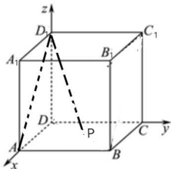

> [!faq]- 《专题01_椭圆的四大常考题型_高效培优专项训练_》官方解析
>
> > [!success]- **【答案】** B
>
> > [!note]- **【解析】**
> > 
> >
> > 如图建系，设正方体边长为1，则 $D_{1}(0,0,1),A(1,0,0),P(x,y,0)x,y\in [0,1]$
> >
> > 可得 $D_{1}A = (1,0, - 1),D_{1}P = (x,y, - 1)$
> >
> > 又因为 $D_{1}A, D_{1}P = \frac{\pi}{6}$ ，所以 $\frac{\sqrt{3}}{2} = \frac{x + 1}{\sqrt{2} \times \sqrt{x^{2} + y^{2} + 1}}$ ，
> >
> > 化简得 $(x-2)^{2}+3y^{2}=3$ ，即得 $\frac{(x-2)^{2}}{3}+y^{2}=1$ $x,y\in[0,1]$
> >
> > 动点 $P$ 的轨迹为椭圆的一部分·
> >
> > 故选 **B**.
