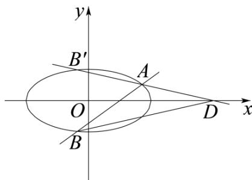

> [!faq]- 《专题01_椭圆的四大常考题型_高效培优专项训练_》官方解析
>
> > [!success]- **【答案】** (1) $\frac{x^{2}}{4}+y^{2}=1$ (2) $\left(0,\frac{3\sqrt{3}}{2}\right)$
>
> > [!note]- **【解析】**
> > （1）设 $P(x,y)$ ，则点 $P$ 到直线 $x = \frac{4\sqrt{3}}{3}$ 的距离为 $d = \left|x - \frac{4\sqrt{3}}{3}\right|$
> >
> > 由题意得， $\frac{|PF|}{d}=\frac{\sqrt{3}}{2}$ ，即 $\frac{\sqrt{\left(x-\sqrt{3}\right)^{2}+\left(y-0\right)^{2}}}{\left|x-\frac{4\sqrt{3}}{3}\right|}=\frac{\sqrt{3}}{2}$ ，
> >
> > 整理化简得 $\frac{x^2}{4} + y^2 = 1$ ，所以曲线 $C$ 的方程为 $\frac{x^2}{4} + y^2 = 1$ .
> >
> > (2) 设 $A(x_{1}, y_{1})$ , $B(x_{2}, y_{2})$ , 则 $B'(x_{2}, -y_{2})$ .
> >
> > 
> >
> > 联立 $\left\{ \begin{array}{l} x = my + 1 \\ \frac{x^2}{4} + y^2 = 1 \end{array} \right.$ 得 $(m^2 + 4)y^2 + 2my - 3 = 0$ ，则 $y_1 + y_2 = -\frac{2m}{m^2 + 4}$ ， $y_1y_2 = -\frac{3}{m^2 + 4}$ .
> >
> > 直线 $AB'$ 的方程为 $y - y_{1} = \frac{y_{1} + y_{2}}{x_{1} - x_{2}} (x - x_{1})$
> >
> > 令 $y = 0$ ，得 $x = \frac{x_1y_2 + x_2y_1}{y_1 + y_2} = \frac{(my_1 + 1)y_2 + (my_2 + 1)y_1}{y_1 + y_2} = \frac{2my_1y_2}{y_1 + y_2} +1 = 4$ ，即 $D(4,0)$
> >
> > 由题意得，直线 l 过定点 $(1,0)$ ，∴ $S_{\triangle ABD} = \frac{1}{2} \cdot (4 - 1) \cdot |y_1 + y_2| = \frac{3}{2} \sqrt{(y_1 + y_2)^2 - 4y_1 y_2}$ ，
> >
> > 化简得 $S_{\triangle ABD} = \frac{6\sqrt{m^2 + 3}}{m^2 + 4} = \frac{6}{\sqrt{m^2 + 3} + \frac{1}{\sqrt{m^2 + 3}}}$
> >
> > 令 $t = \sqrt{m^2 + 3}$ ，则 $t > \sqrt{3}$
> >
> > $\because y = t + \frac{1}{t}$ 在 $(\sqrt{3}, +\infty)$ 上单调递增， $\therefore t + \frac{1}{t} \in \left(\frac{4\sqrt{3}}{3}, +\infty\right)$ ，得 $S_{\triangle ABD} \in \left(0, \frac{3\sqrt{3}}{2}\right)$ .
> >
> > ∴ $\triangle ABD$ 的面积的取值范围为 $\left(0, \frac{3\sqrt{3}}{2}\right)$ .
