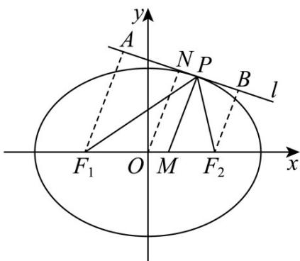

> [!faq]- 《专题01_椭圆的四大常考题型_高效培优专项训练_》官方解析
>
> > [!success]- **【答案】** B
>
> > [!note]- **【解析】**
> > 已知椭圆方程 $\frac{x^2}{a^2} +\frac{y^2}{16} = 1(a > 4)$ ，则 $b^{2} = 16$
> >
> > 根据椭圆的性质 $c^2 = a^2 - b^2$ ，可得 $c = \sqrt{a^2 - 16}$ ，那么椭圆的焦点坐标为 $(\pm \sqrt{a^2 - 16}, 0)$ 。
> >
> > 因为椭圆的焦点在圆 $x^{2} + y^{2} = 9$ 上，将焦点坐标 $(\pm \sqrt{a^2 - 16},0)$ 代入圆的方程可得：
> >
> > $$
> > (\pm \sqrt {a ^ {2} - 1 6}) ^ {2} + 0 ^ {2} = 9
> > $$
> >
> > 即 $a^2 - 16 = 9$ ，移项可得 $a^2 = 9 + 16 = 25$ .
> >
> > 因为 a>0 ，所以 a=5 .
> >
> > 由 a = 5 ， $c = \sqrt{a^{2} - 16} = \sqrt{25 - 16} = 3$ .
> >
> > 根据椭圆离心率公式 $e=\frac{c}{a}$ ，可得 $e=\frac{3}{5}$ .
> >
> > 此椭圆的离心率为 $\frac{3}{5}$
> >
> > 故选：B.
> >
> > 22. 直线 $2x - 3y + 12 = 0$ 经过椭圆 $\frac{x^2}{a^2} + \frac{y^2}{b^2} = 1 (a > b > 0)$ 的两个顶点，则该椭圆的离心率 $e = (\quad)$ A. $\frac{\sqrt{3}}{3}$ B. $\frac{\sqrt{5}}{3}$ C. $\frac{\sqrt{5}}{2}$ D. $\frac{\sqrt{13}}{3}$
> >
> > 【答案】B
> >
> > 【详解】因为直线 $2x - 3y + 12 = 0$
> >
> > 令 x=0 ，则 y=4 ，所以 b=4
> >
> > 令 $y = 0$ ，则 $x = -6$ ，所以 $a = 6$
> >
> > 又因为 $c^2 = a^2 - b^2$ ，所以 $c = 2\sqrt{5}$
> >
> > 则该椭圆的离心率 $e = \frac{2\sqrt{5}}{6} = \frac{\sqrt{5}}{3}$ .
> >
> > 故选：B.
> >
> > 23. 古希腊数学家在研究圆锥曲线时发现了椭圆的光学性质：从椭圆的一个焦点 $F_{1}$ 发出的光线经过椭圆上的点 $P$ 反射后，反射光线经过椭圆的另一个焦点 $F_{2}$ ，且在点 $P$ 处的切线垂直于法线（即 $\angle F_{1}PF_{2}$ 的平分线）
> >
> > 已知椭圆 $C: \frac{x^2}{a^2} + \frac{y^2}{b^2} = 1 (a > b > 0)$ 的焦距为 $2\sqrt{15}$ ，坐标原点 $O$ 到点 $P$ 处切线的距离为 $\frac{a}{2}$ ，且 $\left|PF_1\right| \cdot \left|PF_2\right| = ab$ ，则椭圆 $C$ 的长轴为（）A.4 B.6 C.8 D.16
> >
> > 【答案】C
> >
> > 【详解】如图，设点 $P$ 处的切线为 $l, PM$ 为 $\angle F_{1}PF_{2}$ 的平分线，交 $x$ 轴于点 $M$ ，则 $PM \perp l$ ，过点 $F_{1}, F_{2}$ 分别作 $F_{1}A \perp l, F_{2}B \perp l$ ，垂足分别为 $A, B$ ，过点 $O$ 作 $ON \perp l$ 于点 $N\cdot$ 设 $\angle F_{1}PF_{2} = 2\theta$ ，则 $\angle F_{1}PM = \angle MPF_{2} = \theta$ ·因为 $PM \perp l$ ，所以 $\angle APF_{1} = \angle BPF_{2} = \frac{\pi}{2} - \theta$ ，所以 $\left|AF_{1}\right| = \left|PF_{1}\right|\sin \left(\frac{\pi}{2} - \theta\right) = \left|PF_{1}\right|\cos \theta, \left|BF_{2}\right| = \left|PF_{2}\right|\sin \left(\frac{\pi}{2} - \theta\right) = \left|PF_{2}\right|\cos \theta.$ 因为 $O$ 为 $F_{1}F_{2}$ 的中点，所以由梯形的中位线定理，得 $\left|ON\right| = \frac{1}{2}\left(\left|AF_{1}\right| + \left|BF_{2}\right|\right) = \frac{1}{2}\left(\left|PF_{1}\right|\cos \theta + \left|PF_{2}\right|\cos \theta\right) = \frac{1}{2}\left(\left|PF_{1}\right| + \left|PF_{2}\right|\right)\cos \theta = \frac{1}{2} \times 2a\cos \theta = a\cos \theta = \frac{a}{2}$ 所以 $\cos \theta = \frac{1}{2}\cdot$ 因为 $\theta \in (0, \pi)$ ，所以 $\theta = \frac{\pi}{3}$ ，所以 $\angle F_{1}PF_{2} = 2\theta = \frac{2\pi}{3}\cdot$ 因为 $\left|PF_{1}\right|\cdot\left|PF_{2}\right| = ab$ ，所以在 $\triangle F_{1}PF_{2}$ 中由余弦定理，得 $\left|F_{1}F_{2}\right|^{2} = \left|PF_{1}\right|^{2} + \left|PF_{2}\right|^{2} - 2\left|PF_{1}\right|\left|PF_{2}\right|\cos \frac{2\pi}{3} = \left(\left|PF_{1}\right| + \left|PF_{2}\right|\right)^{2} - 2\left|PF_{1}\right|\left|PF_{2}\right| - 2\left|PF_{1}\right|\left|PF_{2}\right|\cos \frac{2\pi}{3}$ ，即 $4c^{2} = 4a^{2} - 2ab - 2ab\times\left(-\frac{1}{2}\right)$ ，所以 $ab = 4a^{2} - 4c^{2} = 4b^{2}$ ，即 $a = 4b$ ·又因为 $a^{2} - b^{2} = c^{2} = 15$ ，所以 $b = 1, a = 4$ ，即椭圆 $C$ 的长轴为8.
> >
> > 
> >
> > 故选 **C**.
