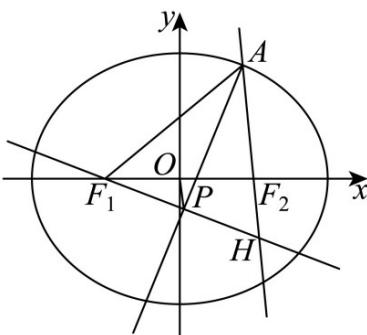

> [!faq]- 《专题01_椭圆的四大常考题型_高效培优专项训练_》官方解析
>
> > [!success]- **【答案】** B
>
> > [!note]- **【解析】**
> > 
> >
> > 根据题意可得 $PA \perp PF_{1}$ ，延长 $F_{1}P$ 与 $AF_{2}$ 交于点 $H$ ，由等腰三角形三线合一可知 $\left|AH\right| = \left|AF_{1}\right| = 6$
> >
> > 由椭圆的定义可得 $\left|AF_1\right| + \left|AF_2\right| = 2a$ ，所以 $\left|AF_2\right| = 2a - 6$
> >
> > 所以 $\left|HF_2\right| = 6 - (2a - 6) = 12 - 2a$ ，由 $OP$ 是 $\triangle F_{1}F_{2}H$ 的中位线，
> >
> > 可得 $\left|F_{2}H\right|=2\left|OP\right|=4$ ，所以12-2a=4，解得a=4，
> >
> > 所以 C 的离心率为 $\sqrt{1-\frac{12}{16}}=\frac{1}{2}$ .
> >
> > 故选 **B**.
