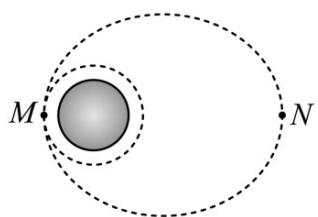

<!-- question-source:start -->
33. 某学校航天兴趣小组利用计算机模拟“天问一号火星探测器”，如图，探测器在环火星椭圆轨道近火星点 $M$ 处制动（俗称“踩刹车”）后，以 $\nu \mathrm{km} / \mathrm{s}$ 的速度进入距离火星表面 $n\mathrm{km}$ 的环火星圆形轨道（火星的球心为椭圆的一个焦点），环绕周期为 $t\mathrm{s}$ 。已知 $R$ 为火星的半径，远火星点 $N$ 到火星表面的最近距离为 $m\mathrm{km}$ ，则下列说法不正确的是（）

A. 椭圆轨道的离心率为 $\frac{m - n}{m + n + 2R}$

B. 圆形轨道的周长为 $vt\mathrm{km}$ C. 火星半径为 $\frac{vt}{2\pi}\mathrm{km}$ D. 近火星点与远火星点的距离为 $\left(m - n + \frac{vt}{\pi}\right)\mathrm{km}$
<!-- question-source:end -->

![[高中/课堂同步/题库/人教A版高中数学同步讲义(2026)/03_选择性必修第一册/第三章 圆锥曲线的方程/专项训练/专题01_椭圆的四大常考题型_高效培优专项训练_/题型四_sec_04/questions/answers/Q00062987A1.md]]
