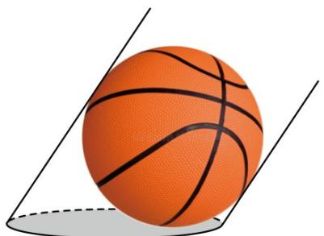
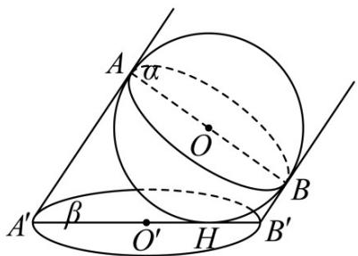

<!-- question-source:start -->
35. 小明同学某天发现，在阳光的照射下，篮球在地面留下的影子如图所示，设过篮球的中心 $O$ 且与太阳平行光线垂直的平面为 $\alpha$ ，地面所在平面为 $\beta$ ，篮球与地面的切点为 $H$ ，球心为 $O$ ，球心 $O$ 在地面的影子为点 $O'$ ；已知太阳光线与地面的夹角为 $\theta$ ；如图， $AB$ 为球 $O$ 的一条直径， $A', B'$ 为 $A, B$ 在地面的影子，点 $H$ 在线段 $A'B'$ 上，小明经过研究资料发现，当 $\theta \neq \frac{\pi}{2}$ 时，篮球的影子为一椭圆，且点 $H$ 为椭圆的焦点，线段 $A'B'$ 为椭圆的长轴，则此时该椭圆的离心率（）（用 $\theta$ 表示）·

A $\cdot \cos \theta$ B $\cdot \sin \theta$ C $\cdot \cos^2\theta$ D $\cdot \frac{\cos\theta}{\sin\theta}$
<!-- question-source:end -->

![[高中/课堂同步/题库/人教A版高中数学同步讲义(2026)/03_选择性必修第一册/第三章 圆锥曲线的方程/专项训练/专题01_椭圆的四大常考题型_高效培优专项训练_/题型四_sec_04/questions/answers/Q00062989A1.md]]
