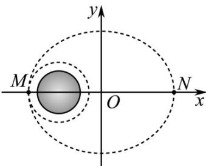

> [!faq]- 《专题01_椭圆的四大常考题型_高效培优专项训练_》官方解析
>
> > [!success]- **【答案】** C
>
> > [!note]- **【解析】**
> > 如图，以线段MN的中点为原点，MN所在直线为x轴，以 $\overline{MN}$ 的方向为x轴正方向建立直角坐标系，
> >
> > 
> >
> > 则可设轨道所在的椭圆的标准方程为 $\frac{x^2}{a^2} +\frac{y^2}{b^2} = 1(a > b > 0)$
> >
> > 则由已知 $m + R = a + c$ ， $n + R = a - c$
> >
> > 所以 $2a = m + n + 2R$ ， $2c = m - n$ ，故离心率为 $\frac{2c}{2a} = \frac{m - n}{m + n + 2R}$ ，故A正确；
> >
> > 以 $v\mathrm{km / s}$ 的速度进入距离火星表面 $n\mathrm{km}$ 的环火星圆形轨道，环绕周期为 $t$ s
> >
> > 所以环绕的圆形轨道周长为 $vtkm$ ，半径为 $\frac{vt}{2\pi}km$ ，所以火星半径为 $\left(\frac{vt}{2\pi}-n\right)\mathrm{km}$ ，
> >
> > 故 $^{B}$ 正确， $^{C}$ 错误，
> >
> > 因为近火星点与远火星点的距离为 $2a = n + 2R + m = n + 2\left(\frac{vt}{2\pi} - n\right) + m = m - n + \frac{vt}{\pi}$ ，故D正确.
> >
> > 故选 **C**.
