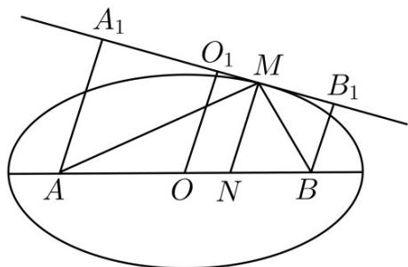

> [!faq]- 《专题01_椭圆的四大常考题型_高效培优专项训练_》官方解析
>
> > [!success]- **【答案】** $\frac{5\sqrt{6}}{2}$
>
> > [!note]- **【解析】**
> > 如图，过 M 作 M 处切线的垂线交 AB 于 N，过 A，O，B 分别作切线的垂线交切线于点 $A_{1}$ ， $O_{1}$ ， $B_{1}$ ，由光学性质可知 MN 平分 $\angle AMB$ ， $\angle B_{1}MB = \angle A_{1}MA$ ，
> >
> > 
> >
> > 则 $\angle A_{1}AM = \angle AMN = \angle BMN = \angle B_{1}BM$
> >
> > 因为 $\cos \angle AMB = -\frac{1}{4}$
> >
> > 故 $\cos (\pi -\angle AMB) = \cos 2\angle AMA_{1} = 1 - 2\sin^{2}\angle AMA_{1} = \frac{1}{4}$
> >
> > 所以 $\sin \angle AMA_{1} = \frac{\sqrt{6}}{4}$
> >
> > $$
> > \left| O O _ {1} \right| = \frac {1}{2} \left(\left| A A _ {1} \right| + \left| B B _ {1} \right|\right) = \frac {1}{2} \left(\left| A M \right| \sin \angle A M A _ {1} + \left| B M \right| \sin \angle B M B _ {1}\right) = \frac {1}{2} \cdot 2 0 \cdot \sin \angle A M A _ {1} = \frac {5 \sqrt {6}}{2}.
> > $$
> >
> > 故答案为： $\frac{5\sqrt{6}}{2}$
