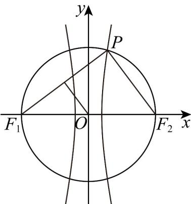

> [!faq]- 《专题02_双曲线的四大常考题型_高效培优专项训练_》官方解析
>
> > [!success]- **【答案】** C
>
> > [!note]- **【解析】**
> > 依题意， $PF_{1} \perp PF_{2}$ ，双曲线 $C: \frac{x^{2}}{a^{2}} - \frac{y^{2}}{6} = 1$ 的半焦距 $c = \sqrt{a^{2} + 6}$ ，
> >
> > 由 $\cos \angle PF_2F_1 = \frac{3}{5}$ ，得 $|PF_{2}| = \frac{3}{5} |F_{1}F_{2}| = \frac{6c}{5}$ ，则 $|PF_{1}| = \frac{8c}{5}$ ，而 $|PF_{1}| - |PF_{2}| = 2a$
> >
> > 于是 $c = 5a$ ，即 $5a = \sqrt{a^2 + 6}$ ，解得 $a = \frac{1}{2}, c = \frac{5}{2}$ ，而点 $O$ 是线段 $F_{1}F_{2}$ 中点，
> >
> > 所以点 O 到直线 $PF_{1}$ 的距离为 $\frac{1}{2}|PF_{2}|=\frac{3c}{5}=\frac{3}{2}$ .
> >
> > 故选：C
> >
> > 
