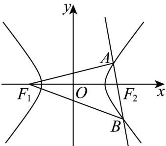

> [!faq]- 《专题02_双曲线的四大常考题型_高效培优专项训练_》官方解析
>
> > [!success]- **【答案】** 24
>
> > [!note]- **【解析】**
> > 设 $\left|AF_{2}\right|=t>0$ ，由 $F_{2}B+2F_{2}A=0$ 知A,B在双曲线的右支上，可得 $\left|BF_{2}\right|=2t,\left|AB\right|=3t$
> >
> > 
> >
> > 所以 $\left|AF_1\right| = t + 2a$ ， $\left|BF_1\right| = 2t + 2a$ ，又由 $AF_{1}\cdot AF_{2} = 0$ ，知 $AF_{1}\perp AB$
> >
> > 所以在 $\mathrm{Rt}\triangle F_1AB$ 中，由勾股定理可得 $(t + 2a)^2 +(3t)^2 = (2t + 2a)^2$
> >
> > 解得 $t = \frac{2a}{3}$ 或 $t = 0$ （舍去），又 $a = 3$ ，则 $t = \frac{2a}{3} = 2$
> >
> > 所以 $\left|AF_1\right| = t + 2a = 2 + 6 = 8$ ， $\left|AB\right| = 3t = 6$
> >
> > 所以 $\triangle F_{1}AB$ 的面积为 $\frac{1}{2} \times 8 \times 6 = 24$ .
> >
> > 故答案为：24·
