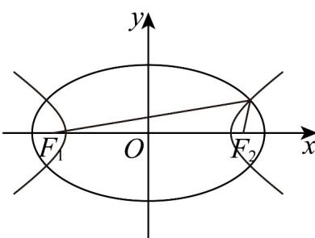

> [!faq]- 《专题02_双曲线的四大常考题型_高效培优专项训练_》官方解析
>
> > [!success]- **【答案】** A
>
> > [!note]- **【解析】**
> > 由曲线 \(C\_1: \frac{x^2}{6} + \frac{y^2}{2} = 1\) 的方程可得 \(F\_1(-2,0), F\_2(2,0)\)，由椭圆的定义可得 \(\left|PF\_1\right| + \left|PF\_2\right| = 2\sqrt{6}\)。
> > 又曲线 \(C\_2: \frac{x^2}{3} - y^2 = 1\) 的焦点和曲线 \(C\_1\) 的焦点相同，不妨设 \(P\) 在双曲线右支上，双曲线的定义可得 \(\left|PF\_1\right| - \left|PF\_2\right| = 2\sqrt{3}\)。\$\therefore \left|PF\_1\right| = \sqrt{6} + \sqrt{3}\$，\(\left|PF\_2\right| = \sqrt{6} - \sqrt{3}\)，
> > 在 \(\triangle PF\_1F\_2\) 中，由余弦定理可得 \(\cos \angle F\_1PF\_2 = \frac{\left(\sqrt{6} + \sqrt{3}\right)^2 + \left(\sqrt{6} - \sqrt{3}\right)^2 - 4^2}{2\left(\sqrt{6} + \sqrt{3}\right)\left(\sqrt{6} - \sqrt{3}\right)} = \frac{1}{3}\)，
> > \$\therefore \sin \angle F\_1PF\_2 = \sqrt{1 - \cos^2 \angle F\_1PF\_2} = \frac{2\sqrt{2}}{3}\$，
> > \$\therefore \triangle PF\_1F\_2\$ 的面积为 \(\frac{1}{2}\left|PF\_1\right|\cdot\left|PF\_2\right|\cdot\sin \angle F\_1PF\_2 = \frac{1}{2}\left(\sqrt{6} + \sqrt{3}\right)\left(\sqrt{6} - \sqrt{3}\right) \times \frac{2\sqrt{2}}{3} = \sqrt{2}\$。
> >
> > 
> >
> > 故选 **A**
