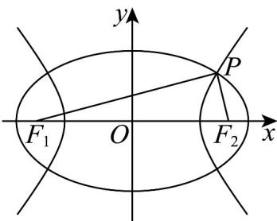

> [!faq]- 《专题02_双曲线的四大常考题型_高效培优专项训练_》官方解析
>
> > [!success]- **【答案】** D
>
> > [!note]- **【解析】**
> > 椭圆 $C_1$ 中， $e_1 = \frac{\sqrt{6}}{3}, c = 2\sqrt{3}, \therefore a_1 = 3\sqrt{2}$ ，双曲线的实半轴长 $a_2$
> >
> > 在三角形 $F_{1}PF_{2}$ 中
> >
> > $$
> > \left\{ \begin{array}{l} \left| P F _ {1} \right| + \left| P F _ {2} \right| = 2 a _ {1} = 6 \sqrt {2} \\ \left| P F _ {1} \right| ^ {2} + \left| P F _ {2} \right| ^ {2} = \left| F _ {1} F _ {2} \right| ^ {2} = 4 8 \\ \left| P F _ {1} \right| - \left| P F _ {2} \right| = 2 a _ {2} \end{array} \right.
> > $$
> >
> > 所以
> >
> > $(|PF_1| + |PF_2|)^2 = |PF_1|^2 + |PF_2|^2 + 2|PF_1|\cdot |PF_2| = 48 + 2|PF_1|\cdot |PF_2| = (6\sqrt{2})^2,$ $\therefore |PF_1|\cdot |PF_2| = 12$
> >
> > 所以 $\left(|PF_1| - |PF_2|\right)^2 = |PF_1|^2 + |PF_2|^2 - 2|PF_1|\cdot |PF_2| = 48 - 2\times 12 = 24$
> >
> > 即 $4a_{2}^{2} = 24, a_{2} = \sqrt{6}$
> >
> > 所以 $b_{2}=\sqrt{c^{2}-a_{2}^{2}}=\sqrt{12-6}=\sqrt{6}$ ，由题焦点在 x 轴上，
> >
> > 故双曲线方程为 $\frac{x^{2}}{6}-\frac{y^{2}}{6}=1$ ，
> >
> > 故选：D.
> >
> > 
