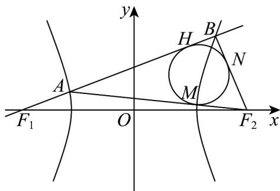

> [!faq]- 《专题02_双曲线的四大常考题型_高效培优专项训练_》官方解析
>
> > [!success]- **【答案】** D
>
> > [!note]- **【解析】**
> > 设 $^{\triangle}ABF_{2}$ 的内切圆分别切 $AF_{2}$ ， $BF_{2}$ 于点M，N，则 $|AH| = |AM| = 8$ ， $|BH| = |BN|$ ， $|MF_{2}| = |NF_{2}|$ ，因为 $|BF_{1}| - |BF_{2}| = 2a$ ，所以 $\left(|HF_{1}| + |BH|\right) - \left(|NF_{2}| + |BN|\right) = 2a$ ，得 $|HF_{1}| - |NF_{2}| = 2a$ ，所以 $\left(|AH| + |AF_{1}|\right) - |MF_{2}| = 2a$ ，即 $8 + |AF_{1}| - |MF_{2}| = 2a$ ，①因为 $\left|AF_2\right| - \left|AF_1\right| = 2a$ ，所以 $\left(\left|AM\right| + \left|MF_2\right|\right) - \left|AF_1\right| = 2a$
> >
> > 即 $8 + \left|MF_{2}\right| - \left|AF_{1}\right| = 2a$ ，②
> >
> > 所以① $^{+②}$ ，得16=4a，得a=4，
> >
> > 因为 $2c = 10$ ，所以 $c = 5$ ，所以 $b = \sqrt{c^2 - a^2} = \sqrt{5^2 - 4^2} = 3$
> >
> > 所以双曲线 $C: \frac{x^2}{a^2} - \frac{y^2}{b^2} = 1 (a > 0, b > 0)$ 的渐近线方程为 $y = \pm \frac{b}{a} x = \pm \frac{3}{4} x$
> >
> > 即 $3x \pm 4y = 0$ .
> >
> > 故选：D.
> >
> > 
