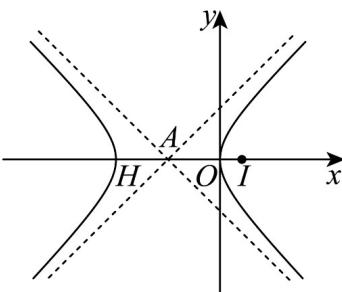

> [!faq]- 《专题02_双曲线的四大常考题型_高效培优专项训练_》官方解析
>
> > [!success]- **【答案】** C
>
> > [!note]- **【解析】**
> > 若 $(x, y)$ 满足 $\sqrt{x + y + 1} \cdot \sqrt{x - y + 1} = 1$ ，则 $(x, -y)$ 代入可得 $\sqrt{x - y + 1} \cdot \sqrt{x + y + 1} = 1$ ，因此 $(x, -y)$ 是 $M$ 中的元素，①正确，
> >
> > 由 可得 $\sqrt{x + y + 1} \cdot \sqrt{x - y + 1} = 1$ ，故 $\left(x + 1\right)^2 - y^2 = 1$ （ $x + 1\right)^2 - y^2 = 1$ （ $x - 1\right)$
> >
> > 因此 M 表示焦点在 x 轴上的双曲线的右支，此双曲线是由等轴双曲线 $x^{2}-y^{2}=1$ 向左平移 1 一个单位长度得到，故该双曲线的渐近线方程为 $y=\pm(x+1)$ ，由于两渐近线互相垂直，而 A 为该双曲线的中心，故 $\angle PAQ<\frac{\pi}{2}$ ，故不存在存在点 P 和点 Q，使得 $AP\perp AQ$ ，②错误，
> >
> > 
> >
> > 由于 M 表示的双曲线的焦点为 $\left(\sqrt{2}-1,0\right)$ ，若直线 PQ 经过点 $\left(\sqrt{2}-1,0\right)$ ，则 $|PQ|$ 的最小值为通径 $\frac{2b^{2}}{a}=2$ ，故③正确，
> > - **④**：若直线 PQ 经过点 $(1,0)$ ，设直线 PQ 方程为 $x=my+1$ ，
> >
> > 联立与双曲线 $\left(x + 1\right)^2 -y^2 = 1\left(x\quad 0\right)$ 方程可得 $\left(m^2 -1\right)y^2 +4my + 3 = 0$
> >
> > 由于 $\Delta = 16m^2 - 12(m^2 - 1) > 0$ ，结合渐近线斜率为 $\pm 1$ ，故 $|m| > 1$
> >
> > 设 $P\left(x_{1},y_{1}\right),Q\left(x_{2},y_{2}\right)$ ，则 $y_{1} + y_{2} = \frac{-4m}{m^{2} - 1},y_{1}y_{2} = \frac{3}{m^{2} - 1}$
> >
> > $$
> > \left| P Q \right| = \sqrt {1 + m ^ {2}} \sqrt {\left(y _ {1} + y _ {2}\right) ^ {2} - 4 y _ {1} y _ {2}} = \sqrt {1 + m ^ {2}} \sqrt {\left(\frac {- 4 m}{m ^ {2} - 1}\right) ^ {2} - 4 \frac {3}{m ^ {2} - 1}} = 2 \sqrt {1 + m ^ {2}} \frac {\sqrt {3 + m ^ {2}}}{\left| m ^ {2} - 1 \right|}
> > $$
> >
> > 又 $O$ 到直线 $PQ$ 的距离为 $d = \frac{1}{\sqrt{m^2 + 1}}$ ，所以 $\triangle OPQ$ 的面积为
> >
> > $S=\frac{1}{2}2\sqrt{1+m^{2}}\frac{\sqrt{3+m^{2}}}{\left|m^{2}-1\right|}\times\frac{1}{\sqrt{m^{2}+1}}=\frac{\sqrt{3+m^{2}}}{\left|m^{2}-1\right|}=\sqrt{5}$ ，考虑到 $|m|>1$ ，解得 $m=\pm\sqrt{2}$ ， $m=\pm\sqrt{\frac{1}{5}}$ （舍去），则直线
> > PQ 的方程为 $x \pm \sqrt{2}y - 1 = 0$ ，故④正确
> >
> > 故选 **C**
