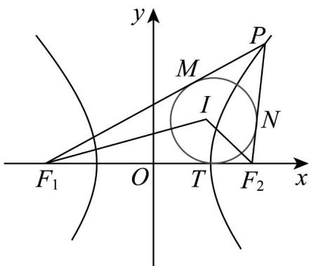

> [!faq]- 《专题02_双曲线的四大常考题型_高效培优专项训练_》官方解析
>
> > [!success]- **【答案】** D
>
> > [!note]- **【解析】**
> > 当 $PF_{2} \perp x$ 轴时，可得 $\left|PF_{2}\right| = \frac{b^{2}}{a} = c = \frac{1}{2}\left|F_{1}F_{2}\right|$ ，此时 $\tan \angle PF_{1}F_{2} = \frac{1}{2}$ ，所以①不正确；因为 $\left|F_{1}F_{2}\right| = \frac{2b^{2}}{a}$ ，所以 $2c = \frac{2b^{2}}{a} = \frac{2c^{2} - 2a^{2}}{a}$ ，整理得 $c^{2} - ac - a^{2} = 0$ ，
> >
> > 可得 $e^2 - e - 1 = 0$ （其中 $e$ 为双曲线的离心率， $e > 1$ ），所以 $e = \frac{1 + \sqrt{5}}{2}$ ，所以②正确；
> >
> > 设 $\triangle PF_{1}F_{2}$ 的内切圆半径为r，
> >
> > 由双曲线的定义可得 $\left|PF_{1}\right|-\left|PF_{2}\right|=2a,\left|F_{1}F_{2}\right|=2c$
> >
> > 其中 $S_{\triangle IPF_1} = \frac{1}{2}\left|PF_1\right|\cdot r,S_{\triangle IPF_2} = \frac{1}{2}\left|PF_2\right|\cdot r,S_{\triangle IF_1F_2} = \frac{1}{2}\cdot 2c\cdot r$
> >
> > 因为 $S_{\triangle IPF_1} = S_{\triangle IPF_2} + I S_{\triangle IF_1F_2}$ ，所以 $\frac{1}{2} |PF_1| \cdot r = \frac{1}{2} |PF_2| \cdot r + \lambda c \cdot r$
> >
> > 解得 $\lambda=\frac{\left|PF_{1}\right|-\left|PF_{2}\right|}{2c}=\frac{a}{c}=\frac{1}{e}=\frac{\sqrt{5}-1}{2}$ ，所以③正确；
> >
> > 设内切圆与 $PF_{1}, PF_{2}, F_{1}F_{2}$ 的切点分别为 M, N, T
> >
> > 可得 $\left|PM\right|=\left|PN\right|,\left|F_{1}M\right|=\left|F_{1}T\right|,\left|F_{2}N\right|=\left|F_{2}T\right|$
> >
> > 因为 $\left|PF_1\right| - \left|PF_2\right| = \left|F_1M\right| - \left|F_2N\right| = \left|F_1T\right| - \left|F_2T\right| = 2a,\left|F_1F_2\right| = \left|F_1T\right| + \left|F_2T\right| = 2c$
> >
> > 可得 $\left|F_{2}T\right|=c-a$ ，则点T的坐标为 $(a,0)$
> >
> > 所以 I 点横坐标为 a，所以④正确·
> >
> > 故选：D.
> >
> > 
> >
> > 题型四：双曲线综合问题
