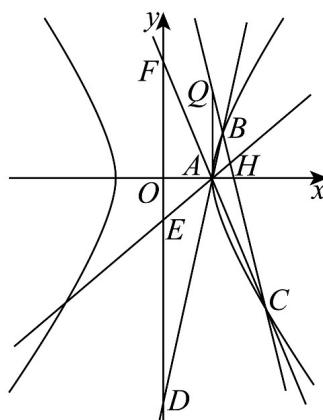

> [!faq]- 《专题02_双曲线的四大常考题型_高效培优专项训练_》官方解析
>
> > [!success]- **【答案】** (1) $x^{2}-\frac{y^{2}}{3}=1$ (2) (i) -2 ; (ii) 证明见解析
>
> > [!note]- **【解析】**
> > （1）由题意，得 $\frac{b}{a} = \sqrt{3}$ ，则 $b = \sqrt{3} a$ ①，
> >
> > 将点 $P\left(\sqrt{3}, \sqrt{6}\right)$ 代入双曲线方程，得 $\frac{3}{a^2} - \frac{6}{b^2} = 1$ ②，
> >
> > 联立①②解得 $\left\{ \begin{array}{l}a^2 = 1\\ b^2 = 3 \end{array} \right.$ ，故的方程为 $x^{2} - \frac{y^{2}}{3} = 1\cdot$
> >
> > (2) 若直线 $l$ 的斜率不存在，则直线 $l$ 与双曲线右支只有一个交点，不符合题意，故直线 $l$ 的斜率存在设直线 $l$ 的方程为 $y - 2 = k(x - 1)$ ，
> >
> > 与 $x^{2} - \frac{y^{2}}{3} = 1$ 联立得 $\left(3 - k^2\right)x^2 +\left(2k^2 -4k\right)x - k^2 +4k - 7 = 0\cdot$
> >
> > $$
> > \left\{ \begin{array}{l} 3 - k ^ {2} \neq 0 \\ \Delta = 1 2 (7 - 4 k) > 0 \end{array} \right.
> > $$
> >
> > 设 、，由题意，得 $\left\{x_{1}+x_{2}=\frac{2k^{2}-4k}{k^{2}-3}>0\right.$ ，解得
> >
> > $$
> > B \left(x _ {1}, y _ {1}\right) \quad C \left(x _ {2}, y _ {2}\right)
> > $$
> >
> > $$
> > \left\lfloor x _ {1} x _ {2} = \frac {k ^ {2} - 4 k + 7}{k ^ {2} - 3} > 0 \right.
> > $$
> >
> > $$
> > k <   - \sqrt {3}
> > $$
> >
> > (i) 因为 $H$ 为 $BC$ 中点，所以 $x_{H} = \frac{k^{2} - 2k}{k^{2} - 3}$ .
> >
> > 由 $S_{\triangle AQH} = \frac{1}{2}\left|AQ\right|\left|x_H - 1\right| = \frac{k^2 - 2k}{k^2 - 3} - 1 = 7$ ，得 $7k^2 + 2k - 24 = (7k - 12)(k + 2) = 0\cdot$
> >
> > 又 $k < -\sqrt{3}$ ，解得 $k = -2$ ，所以直线 $l$ 的斜率为 $-2\cdot$
> >
> > (ii) 设直线 $AB$ 的方程为 $y = \frac{y_1}{x_1 - 1}(x - 1)$ ，令 $x = 0$ ，得 $y_D = \frac{-y_1}{x_1 - 1}$ .
> >
> > 同理可得， $y_{E}=\frac{-y_{H}}{x_{H}-1}$ ， $y_{F}=\frac{-y_{2}}{x_{2}-1}$ ，
> >
> > 因为 $E$ 为 $DF$ 中点，所以 $2y_{E} = y_{D} + y_{F}$ ，即 $\frac{-2y_H}{x_H - 1} = \frac{-y_1}{x_1 - 1} +\frac{-y_2}{x_2 - 1}.$
> >
> > 又因为点 B 、 C 、 H 都在直线 l 上，
> >
> > 所以 $\frac{2\left[k(x_H - 1) + 2\right]}{x_H - 1} = \frac{\left[k(x_1 - 1) + 2\right](x_2 - 1) + \left[k(x_2 - 1) + 2\right](x_1 - 1)}{(x_1 - 1)(x_2 - 1)}$
> >
> > 整理，得 $2k + \frac{4}{x_H - 1} = 2k + \frac{2(x_1 + x_2) - 4}{(x_1 - 1)(x_2 - 1)}$
> >
> > 代入韦达定理，得 $x_{H} = \frac{2k - 7}{2k - 3}$ ，所以 $y_{H} = k(x_{H} - 1) + 2 = \frac{-6}{2k - 3}$
> >
> > 因为 $3x_{H} - 2y_{H} = 3 \cdot \frac{2k - 7}{2k - 3} - 2 \cdot \frac{-6}{2k - 3} = \frac{6k - 9}{2k - 3} = 3$ ，所以点 $H$ 恒在定直线 $3x - 2y - 3 = 0$ 上
> >
> > 
