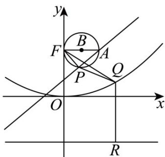

> [!faq]- 《专题03_抛物线的四大常考题型_高效培优专项训练_》官方解析
>
> > [!success]- **【答案】** C
>
> > [!note]- **【解析】**
> > $F(0,4)$ ，因为 $FP \perp l$ ，垂足为 P，
> >
> > 所以点 P 的轨迹是以 FA 为直径的圆（不包括 F，A 两点），
> >
> > 半径 $r = \frac{1}{2} |FA| = \frac{3}{2}$ ，圆心为 $B\left(\frac{3}{2},4\right)$ ，又因为 $Q$ 在抛场线 $C:x^{2} = 16y$ 上，
> >
> > 其准线为直线 y = -4 ，过点 Q 作准线的垂线，垂足为 R ，
> >
> > 则 $\left|FQ\right|+\left|PQ\right|=\left|QR\right|+\left|PQ\right|\quad\left|PR\right|$
> >
> > 当 $B, P, Q, R$ 四点共钱且 $P$ 在 $B$ 点下方时取等号，
> >
> > $$
> > \left(\left| F Q \right| + \left| P Q \right|\right) _ {\min} = \left| B R \right| - r = 8 - \frac {3}{2} = \frac {1 3}{2}
> > $$
> >
> > 故选：C.
> >
> > 
