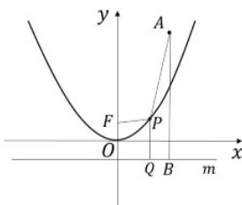
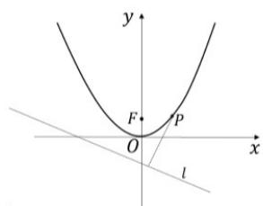
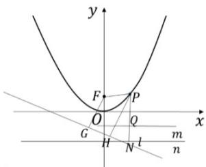
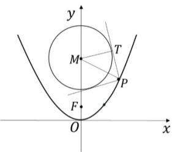

> [!faq]- 《专题03_抛物线的四大常考题型_高效培优专项训练_》官方解析
>
> > [!success]- **【答案】** ABD
>
> > [!note]- **【解析】**
> > 对于 A，抛物线 $C: x^{2} = 4y$ ，焦点 $F(0,1)$ ，准线 m: y = -1， $A(3,4)$ ，过点 P 作准线 m: y = -1 的垂线，垂足为 Q，
> > 再过点 A 作准线 m: y = -1 的垂线，垂足为 B，
> >
> > 
> >
> > 由抛物线定义可知： $\left|AP\right|+\left|PF\right|=\left|AP\right|+\left|PQ\right|\quad\left|AB\right|=4-\left(-1\right)=5$ ，故 A 正确；
> > 对于 B，设点 $P(x_{0},y_{0})$ ，则 $x_{0}^{2}=4y_{0}$ ，
> >
> > 
> >
> > 由点 P 到直线 l : $3x + 4y + 6 = 0$ 的距离公式可得：
> >
> > $d = \frac{\left|3x_0 + 4y_0 + 6\right|}{\sqrt{9 + 16}} = \frac{\left|3x_0 + x_0^2 + 6\right|}{5} = \frac{\left|\left(x_0 + \frac{3}{2}\right)^2 + \frac{15}{4}\right|}{5}$ $\frac{3}{4}$ ，故B正确；
> >
> > 对于 $C$ ，过点 $P$ 作准线 $m:y = -1$ 的垂线，垂足为 $Q$
> >
> > 过点 $P$ 作直线 $n:y = -2$ 的垂线，垂足为 $N$
> >
> > 过点 P 作直线 $l:3x+4y+6=0$ 的垂线，垂足为 H，
> >
> > 过点 F 作直线 $l:3x+4y+6=0$ 的垂线，垂足为 G
> >
> > 
> >
> > 由点 $F$ 到直线 $l: 3x + 4y + 6 = 0$ 的距离公式可得： $\left|FG\right| = \frac{\left|3 \times 0 + 4 \times 1 + 6\right|}{\sqrt{9 + 16}} = \frac{10}{5} = 2$
> >
> > 则点 $P$ 到直线 $l$ 与到直线 $y = -2$ 的距离之和为：
> >
> > $\left|PH\right| + \left|PN\right| = \left|PH\right| + \left|PQ\right| + 1 = \left|PH\right| + \left|PF\right| + 1$ $|FG| + 1 = 2 + 1 = 3$ ，故C错误；
> >
> > 对于 D
> >
> > 
> >
> > 根据过点 $P$ 可作两条垂直的直线与圆 $x^{2} + (y - 4)^{2} = r^{2}$ 相切，可知 $\left|MP\right| = \sqrt{\left|PT\right|^2 + r^2}$
> >
> > 由于两条切线垂直，可知 $\angle MPT = \frac{\pi}{4}$ ，即 $|PT| = r$ ，所以有 $|MP| = \sqrt{2} r$ ，
> >
> > 从而把问题转化为抛物线上存在点 $P$ 到圆心 $M$ 的距离为 $\sqrt{2} r$
> >
> > 先求抛物线上点 $P(x_0, y_0)$ 到圆心 $M(0, 4)$ 的距离：
> >
> > $$
> > \left| M P \right| = \sqrt {x _ {0} ^ {2} + \left(y _ {0} - 4\right) ^ {2}} = \sqrt {4 y _ {0} + y _ {0} ^ {2} - 8 y _ {0} + 1 6} = \sqrt {\left(y _ {0} - 2\right) ^ {2} + 1 2} \quad 2 \sqrt {3}
> > $$
> >
> > 当 $y_0 = 2$ 时， $\left|MP\right|$ 取到最小值 $2\sqrt{3}$
> >
> > 即 $\sqrt{2} r$ $2\sqrt{3}$ ，解得 $r$ $\sqrt{6}$ ，故D正确·
> >
> > 故选 **ABD**.
