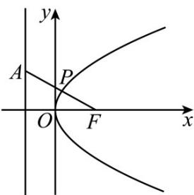
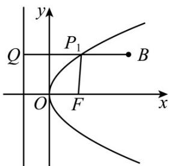

> [!faq]- 《专题03_抛物线的四大常考题型_高效培优专项训练_》官方解析
>
> > [!success]- **【答案】** $(1)①\sqrt{5}$ ; ② $^{4}$ ; $(2)P(0,0)$ , $\frac{2}{3}$
>
> > [!note]- **【解析】**
> > （1）①抛物线焦点为 $F(1,0)$ ，准线方程为x=-1，
> >
> > 
> >
> > ∵点 P 到准线 x=-1 的距离等于 P 到点 $F(1,0)$ 的距离.
> >
> > ∴问题转化为：在曲线上求一点 P，使点 P 到 $A(-1,1)$ 的距离与 P 到 $F(1,0)$ 的距离之和最小.
> >
> > 显然 $P$ 是 $AF$ 的连线与抛物线的交点，最小值为 $\left|AF\right| = \sqrt{5}$
> > - **②**：同理 PF 与 P 点到准线的距离相等·如图：
> >
> > 
> >
> > 过 B 作 $BQ \perp$ 准线于 Q 点，交抛物线于 $P_{1}$ 点.
> >
> > $\therefore \left|P_{1}Q\right| = \left|P_{1}F\right|$
> >
> > $$
> > \therefore | P B | + | P F | \quad | P _ {1} B | + | P _ {1} Q | = | B Q | = 4.
> > $$
> >
> > $\therefore \left|PB\right| + \left|PF\right|$ 的最小值为4.
> >
> > (2) 由题意设抛物线上任一点 P 的坐标为 $(x, y)$
> >
> > 则 $\left|PA\right|^{2}=\left(x-\frac{2}{3}\right)^{2}+y^{2}=\left(x-\frac{2}{3}\right)^{2}+2x=\left(x+\frac{1}{3}\right)^{2}+\frac{1}{3}$
> >
> > 因为 x 0，所以当 x=0 时， $\left|PA\right|_{\min}=\frac{2}{3}$
> >
> > 故距离点 A 最近的点 P 的坐标为 $(0,0)$ ，最短距离是 $\frac{2}{3}$ .
