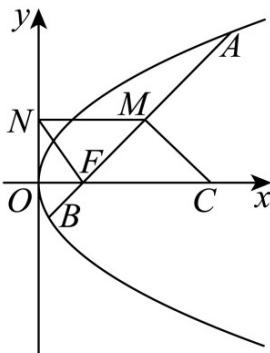

<!-- question-source:start -->
30．如图，抛物线 $E:y^{2}=4x$ 的焦点为F，过点F且斜率为1的直线交抛物线E于A,B两点，线段AB的中点为M，其垂直平分线交x轴于点 $C,MN\perp y$ 轴于点N，则四边形CMNF的面积等于（）

A. 12 B. 8 C. 6 D. 7
<!-- question-source:end -->

![[高中/课堂同步/题库/人教A版高中数学同步讲义(2026)/03_选择性必修第一册/第三章 圆锥曲线的方程/专项训练/专题03_抛物线的四大常考题型_高效培优专项训练_/题型三_sec_04/questions/answers/Q00063054A1.md]]
