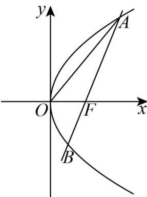

> [!faq]- 《专题03_抛物线的四大常考题型_高效培优专项训练_》官方解析
>
> > [!success]- **【答案】** B
>
> > [!note]- **【解析】**
> > 
> >
> > 设
> >
> > $F(\frac{p}{2},0)$
> >
> > $$
> > A (x _ {1}, y _ {1}), B (x _ {2}, y _ {2})
> > $$
> >
> > 由抛物线的焦半径公式得 $|AF|=x_{1}+\frac{p}{2},|BF|=x_{2}+\frac{p}{2}$ ，
> > 因为 $|AF|=2|BF|$ ，所以 $x_{1}+\frac{p}{2}=2(x_{2}+\frac{p}{2})$ ，
> > 可得 $x_{1}=2x_{2}+\frac{p}{2}$ ，由题意知直线 AB 的斜率不为 0，
> > 设直线 AB 的方程为 $x=my+\frac{p}{2}$ ，
> > 代入抛物线方程 $y^{2}=2px$ 得 $y^{2}=2p(my+\frac{p}{2})$ ，
> > 即 $y^{2}-2pmt-p^{2}=0$ ，因为 $\Delta=(-2pm)^{2}+4p^{2}>0$ ，
> > 根据韦达定理有 $y_{1}y_{2}=-p^{2}$ ，
> > 又因为 $|AF|=2|BF|$ ，所以 $y_{1}=-2y_{2}$ ，
> > 代入 $y_{1}y_{2}=-p^{2}$ 得 $x_{1}=p$ ，
> > 因为抛物线 $y^{2}=2px$ 关于 x 轴对称，
> > 所以不妨假设点 A 在第一象限，
> > 则 $A(p,\sqrt{2}p)$ ，所以 $AO=\left(-p,-\sqrt{2}p\right), AF=\left(-\frac{p}{2},-\sqrt{2}p\right)$
> >
> > 根据向量的夹角公式有 $\cos\angle OAF=\frac{\frac{AO}{AO}\cdot\frac{AE}{AF}}{\left|AO\right|\cdot\left|AF\right|}=\frac{\frac{p^{2}}{2}+2p^{2}}{\sqrt{p^{2}+2p^{2}}\cdot\sqrt{\frac{p^{2}}{4}+2p^{2}}}=\frac{\frac{5p^{2}}{2}}{\sqrt{3}p\cdot\frac{3}{2}p}=\frac{5\sqrt{3}}{9}$ ，
> > 所以 $\sin\angle OAF=\sqrt{1-(\cos\angle OAF)^{2}}=\frac{\sqrt{6}}{9}.$
> >
> > 故选 **B**.
