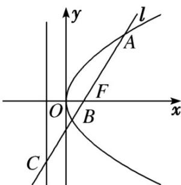

<!-- question-source:start -->
16.如图，过抛物线 $y^{2}=2px(p>0)$ 的焦点F的直线l交抛物线于点A，B，交其准线于点C，若 $|BC|=2|BF|$ ，且 $|AF|=6$ ，则此抛物线方程为（）

A. $y^{2} = 9x$ B. $y^{2} = 6x$

C. $y^{2} = 3x$ D. $y^{2} = \sqrt{3} x$
<!-- question-source:end -->

![[高中/课堂同步/题库/人教A版高中数学同步讲义(2026)/03_选择性必修第一册/第三章 圆锥曲线的方程/专项训练/专题03_抛物线的四大常考题型_高效培优专项训练_/题型二_sec_03/questions/answers/Q00063040A1.md]]
