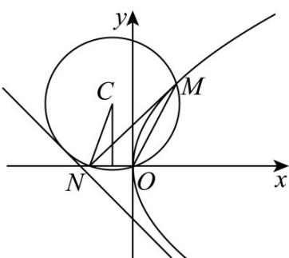

> [!faq]- 《专题03_抛物线的四大常考题型_高效培优专项训练_》官方解析
>
> > [!success]- **【答案】** C
>
> > [!note]- **【解析】**
> > 由抛物线方程 $E:y^{2} = 2px(p > 0)$ ，设圆心 $C(x_0,y_0)$ ，半径为 $_R$ ，显然 $x_0 = -\frac{p}{4}$
> >
> > 
> >
> > 因为 $\cos\angle OMN=\frac{2\sqrt{5}}{5}$ ， $\angle OMN\in\left(0,\frac{\pi}{2}\right)$ ，故 $\sin\angle OMN=\frac{\sqrt{5}}{5}$ ；
> >
> > 在 中，由正弦定理得 $\frac{|ON|}{\sin\angle OMN} = \frac{\frac{p}{2}}{\frac{\sqrt{5}}{5}} = 2R$ ，解得 $R = \frac{\sqrt{5}p}{4}$ ；
> > △MNO
> > 则 $y_{0}=\pm\sqrt{R^{2}-\left(\frac{|ON|}{2}\right)^{2}}=\pm\sqrt{\left(\frac{\sqrt{5}}{4}p\right)^{2}-\left(\frac{p}{4}\right)^{2}}=\pm\frac{p}{2}$ 又圆 C 与直线 $2x + y + 1 = 0$ 相切，故圆心到直线的距离 d = R，
> > 当 $y_{0}=\frac{p}{2}$ 时，则圆心到直线的距离 $d=\frac{\left|2\times\left(-\frac{p}{4}\right)+\frac{p}{2}+1\right|}{\sqrt{2^{2}+1^{2}}}=\frac{1}{\sqrt{5}}=R=\frac{\sqrt{5}p}{4}$ ，解得 $p=\frac{4}{5}$ 当 $y_{0}=-\frac{p}{2}$ 时，则圆心到直线的距离 $d=\frac{\left|2\times\left(-\frac{p}{4}\right)-\frac{p}{2}+1\right|}{\sqrt{2^{2}+1^{2}}}=\frac{\left|1-p\right|}{\sqrt{5}}=R=\frac{\sqrt{5}p}{4}$ ，解得 $p=\frac{4}{9}$ 或 -4 （舍），综上 $p=\frac{4}{5}$ 或 $\frac{4}{9}$ .
> >
> > 故选 **C**.
