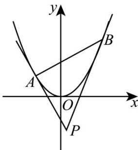

> [!faq]- 《专题03_抛物线的四大常考题型_高效培优专项训练_》官方解析
>
> > [!success]- **【答案】** B
>
> > [!note]- **【解析】**
> > 设 $A(x_{1},y_{1})$ ， $B(x_{2},y_{2})$ ， $\triangle PAB$ 的重心为 $G(x,y)$ 由定理1.1知 $P\left(\frac{x_1 + x_2}{2},x_1x_2\right)$ ，则由三角形的重心坐标公式，可得 $x = \frac{x_1 + x_2 + x_P}{3} = x_P$ ， $y = \frac{y_1 + y_2 + y_P}{3} = \frac{x_1^2 + x_2^2 + x_1x_2}{3} = \frac{(x_1 + x_2)^2 - x_1x_2}{3} = \frac{4}{3} x_P^2 -\frac{1}{3} y_P$ 于是， $x_{P} = x$ ， $y_{P} = 4x_{P}^{2} - 3y = 4x^{2} - 3y$
> >
> > 由点 $P$ 在直线 $l: x - y - 2 = 0$ 上得 $x - (4x^2 - 3y) - 2 = 0$ ，即 $y = \frac{4}{3} x^2 - \frac{1}{3} x + \frac{2}{3}$ .
> >
> > 其中定理1.1及证明：如图，抛物线 $x^{2} = 2py(p > 0)$ 上两个不同的点A， $B$ 的坐标分别为 $A(x_{1},y_{1})$ ， $B(x_{2},y_{2})$
> >
> > 以 A，B 为切点的切线 PA，PB 相交于点 P，我们称弦 AB 为阿基米德 $\triangle PAB$ 的底边。
> >
> > 
> >
> > 定理1.1. 点 $P$ 的坐标为 $\left(\frac{x_1 + x_2}{2}, \frac{x_1x_2}{2p}\right)$ ；
> >
> > 证明：由 $y = \frac{x^2}{2p}$ ，则 $y' = \frac{x}{p}$
> >
> > 所以过点 $_{A}$ 的切线方程为 $y - \frac{x_{1}^{2}}{2p} = \frac{x_{1}}{p}(x - x_{1})$ ，
> >
> > 过点 的切线方程为 $y - \frac{x_{2}^{2}}{2p} = \frac{x_{2}}{p}(x - x_{2})$ ，联立这两个方程 $\left\{\begin{aligned}y - \frac{x_{1}^{2}}{2p} &= \frac{x_{1}}{p}(x - x_{1}) \\ y - \frac{x_{2}^{2}}{2p} &= \frac{x_{2}}{p}(x - x_{2})\end{aligned}\right.$
> >
> > 消去 $y$ ，可得 $x = \frac{x_1 + x_2}{2}$ ，再将 $x = \frac{x_1 + x_2}{2}$ 代入点A处的切线方程，
> >
> > 可得 $y = \frac{x_1^2}{2p} +\frac{x_1}{p}\left(\frac{x_1 + x_2}{2} -x_1\right) = \frac{x_1x_2}{2p}$
> >
> > 这表明，点 $P$ 的坐标为 $\left(\frac{x_1 + x_2}{2},\frac{x_1x_2}{2p}\right)$
> >
> > 故选 **B**.
