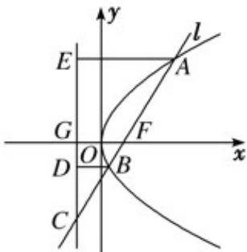

> [!faq]- 《专题03_抛物线的四大常考题型_高效培优专项训练_》官方解析
>
> > [!success]- **【答案】** B
>
> > [!note]- **【解析】**
> > 
> >
> > 如图分别过点 A, B 作准线的垂线，分别交准线于点 E, D，
> >
> > 设 $|BF|=a$ ，则由已知得： $|BC|=2a$ ，由抛物线定义得： $|BD|=a$ ，故 $\angle BCD=30^{\circ}$ ，在直角三角形ACE中，因为 $|AE|=|AF|=6$ ， $|AC|=6+3a$ ， $2|AE|=|AC|$ ，所以 $6+3a=12$ ，从而得 $a=2$ ， $|FC|=3a=6$ ，所以 $p=|FG|=\frac{1}{2}|FC|=3$ ，因此抛物线方程为 $y^{2}=6x$ 。
> >
> > 故选 **B**
