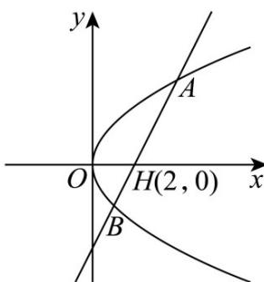

> [!faq]- 《专题03_抛物线的四大常考题型_高效培优专项训练_》官方解析
>
> > [!success]- **【答案】** (1) $y^{2}=4x$ (2)6
>
> > [!note]- **【解析】**
> > （1）设 $M(x,y)$ ，动圆 $M$ 的半径 $r = \sqrt{(x - 1)^2 + y^2} = |x + 1|$
> >
> > 整理可得 $y^{2}=4x$ 。故曲线 C 的方程为 $y^{2}=4x$ 。
> >
> > (2) 法一：
> >
> > 设 $A(x_{1},y_{1}),B(x_{2},y_{2})$ ，不妨设点A在 $x$ 轴上方，
> >
> > 由 $AH = 2HB$ 可得 $y_{1} = -2y_{2}$
> >
> > 由已知直线 $l$ 斜率必不为0，故可设直线 $l: x = ty + 2$
> >
> > 联立方程 $\left\{ \begin{array}{l} y^{2} = 4x \\ x = ty + 2 \end{array} \right.$ ，可得 $y^{2} - 4ty - 8 = 0$ ，
> >
> > 故 $\left\{ \begin{array}{l} \Delta = 16t^2 + 32 > 0 \\ y_1 + y_2 = 4t \\ y_1 \cdot y_2 = -8 \\ y_1 = -2y_2 \end{array} \right.$ ，解得 $\left\{ \begin{array}{l} y_1 = 4 \\ y_2 = -2 \\ y_1 + y_2 = 4t = 2 \\ \Delta = 16t^2 + 32 = 36 \end{array} \right.$ ，故 $A(4,4), B(1,-2)$
> >
> > $S_{\triangle OAB} = S_{\triangle OHA} + S_{\triangle OHB} = \frac{1}{2}\times |OH|\times |y_1 - y_2| = \frac{1}{2}\times 2\times 6 = 6$
> >
> > 
> >
> > 法二：
> >
> > 设 $A(x_{1},y_{1}),B(x_{2},y_{2})$ ，不妨设点A在 $x$ 轴上方，
> >
> > 由 $AH = 2HB$ 可得 $2 - x_{1} = 2(x_{2} - 2), 2x_{2} + x_{1} = 6$
> >
> > 若直线 $l$ 的斜率不存在，则 $\overline{AH} = \overline{HB}$ ，不符合题意，舍去；
> >
> > 设直线 $l:y = k(x - 2)$
> >
> > 联立方程 $\left\{\begin{aligned}y^{2}&=4x,\\ y&=k(x-2)\end{aligned}\right.$ 可得 $k^{2}x^{2}-4(k^{2}+1)x+4k^{2}=0$
> >
> > $\left\{ \begin{array}{l} x_{1} + x_{2} = 4 + \frac{4}{k^{2}} \\ x_{1} \cdot x_{2} = 4 \\ x_{1} + 2x_{2} = 6 \end{array} \right.$ ，解得
> >
> > $$
> > A (4, 4), B (1, - 2) \quad | A B | = \sqrt {3 ^ {2} + 6 ^ {2}} = 3 \sqrt {5}
> > $$
> >
> > $x_{1} + x_{2} = 5 = 4 + \frac{4}{k^{2}}$ ，解得 $k^2 = 4$
> >
> > 原点 O 到直线 l 的距离 $d = \frac{|2k|}{\sqrt{1+k^{2}}} = \frac{4}{\sqrt{5}} = \frac{4\sqrt{5}}{5}$ ，
> >
> > 故 $\triangle OAB$ 的面积 $= \frac{1}{2} \times |AB| \times d = \frac{1}{2} \times 3\sqrt{5} \times \frac{4}{\sqrt{5}} = 6$ .
