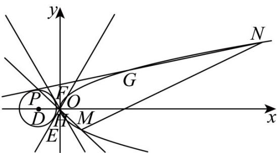

> [!faq]- 《专题03_抛物线的四大常考题型_高效培优专项训练_》官方解析
>
> > [!success]- **【答案】** (1) $y^{2}=4x$ (2)① $r = 2\sqrt{3}$ ; ② $8\sqrt{14}$
>
> > [!note]- **【解析】**
> > （1）因为 $C: y^{2} = 2px (p > 0)$ 中的 $x \in (0, +\infty)$
> >
> > 所以点 $A_{1}(-2,1)$ 不可能在 C 上，
> >
> > 点 $A_{3}(2,2), A_{4}(2,-2)$ 关于 $x$ 轴对称，要么都在 $C$ 上，要么都不在 $C$ 上，
> >
> > 因为 C 只经过四个点中的一点，所以 $A_{3}, A_{4}$ 都不在 C 上，
> >
> > 所以点 $A_{2}(1,-2)$ 在 C 上，将其坐标代入 $y^{2}=2px$ ，得 p=2
> >
> > 所以 $C$ 的方程为 $y^{2} = 4x$
> >
> > (2) (i) 由题可知，O, E, D, F 四点共圆，该圆是以 OD 为直径的圆，
> >
> > 又 $D(-4,0)$ ，所以该圆的方程为 $(x + 2)^{2} + y^{2} = 4$
> >
> > 与圆 $D$ 的方程 $(x + 4)^2 + y^2 = r^2 (r > 0)$ 相减，得直线 $EF$ 即 $C$ 的准线的方程为 $x = \frac{r^2 - 16}{4} = -1$
> >
> > 解得 $r = 2\sqrt{3}$
> >
> > (ii) 由 (i) 可知 $P(-4, 2\sqrt{3})$
> >
> > 设 $M(x_{1},y_{1}),N(x_{2},y_{2})$
> >
> > 因为点 G，H 在 C 上，所以 $\left(\frac{2\sqrt{3}+y_{1}}{2}\right)^{2}=4\times\frac{-4+x_{1}}{2}$ ，
> >
> > 将 $y_{1}^{2} = 4x_{1}$ 代入，可得 $y_{1}^{2} - 4\sqrt{3} y_{1} - 44 = 0$
> >
> > 同理有 $y_{2}^{2} - 4\sqrt{3} y_{2} - 44 = 0$
> >
> > 所以 $y_{1}, y_{2}$ 是方程 $y^{2} - 4\sqrt{3}y - 44 = 0$ 的两个根，
> >
> > 所以 $y_{1} + y_{2} = 4\sqrt{3},y_{1}y_{2} = -44$
> >
> > 所以 $\left|MN\right|=\sqrt{\left(x_{1}-x_{2}\right)^{2}+\left(y_{1}-y_{2}\right)^{2}}=\sqrt{\left(\frac{y_{1}^{2}}{4}-\frac{y_{2}^{2}}{4}\right)^{2}+\left(y_{1}-y_{2}\right)^{2}}$ $=\sqrt{\left[\frac{1}{16}\left(y_{1}+y_{2}\right)^{2}+1\right]\left(y_{1}-y_{2}\right)^{2}}=\sqrt{\left[\frac{1}{16}\left(y_{1}+y_{2}\right)^{2}+1\right]\left[\left(y_{1}+y_{2}\right)^{2}-4y_{1}y_{2}\right]}$ $=\sqrt{\left(\frac{1}{16}\times48+1\right)\times224}$ $=8\sqrt{14}$ .
> >
> > 
