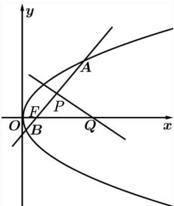
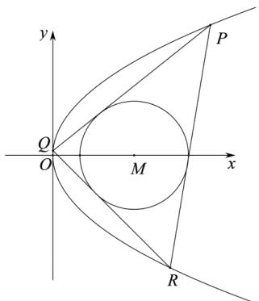

> [!faq]- 《专题03_抛物线的四大常考题型_高效培优专项训练_》官方解析
>
> > [!success]- **【答案】** (1) $y^{2}=4x$ (2)证明见解析
>
> > [!note]- **【解析】**
> > （1）以 $F$ 为圆心且与 $l$ 相切的圆的方程为 $\left(x - \frac{p}{2}\right)^2 + y^2 = p^2$
> >
> > 将 $y^{2}=2px$ 代入并整理，得 $4x^{2}+4px-3p^{2}=0$ ，即 $(2x+3p)(2x-p)=0$ 。
> >
> > 考虑到 x 0，解得 $x=\frac{p}{2}$ ，代入 $y^{2}=2px$ ，解得 $y=\pm p$ ，
> >
> > 所以点 $M, N$ 的坐标分别为 $\left(\frac{p}{2}, p\right), \left(\frac{p}{2}, -p\right)$ ，所以 $|MN| = 2p = 4$ ，解得 $p = 2$
> >
> > 故 $E$ 的方程为 $y^{2} = 4x$ .
> >
> > (2) 证明：设直线 $AB: y = k(x - 1)(k \neq 0)$ ,
> >
> > 由 $\left\{\begin{aligned}y&=k(x-1),\\ y^{2}&=4x,\end{aligned}\right.$ 得 $k^{2}x^{2}-2(k^{2}+2)x+k^{2}=0$
> >
> > 显然判别式 $\Delta = 16k^{2} + 16 > 0$
> >
> > 设 $A(x_{1},y_{1}), B(x_{2},y_{2})$ ，则 $x_{1} + x_{2} = 2 + \frac{4}{k^{2}}$ ，
> >
> > 所以 $x_{P} = \frac{x_{1} + x_{2}}{2} = 1 + \frac{2}{k^{2}},y_{P} = k(x_{P} - 1) = k\left(1 + \frac{2}{k^{2}} -1\right) = \frac{2}{k}$ ，即 $P\left(1 + \frac{2}{k^2},\frac{2}{k}\right)$
> >
> > 由抛物线的定义，得 $\left|AB\right|=\left|AF\right|+\left|BF\right|=\left(x_{1}+1\right)+\left(x_{2}+1\right)=x_{1}+x_{2}+2=2+\frac{4}{k^{2}}+2=4+\frac{4}{k^{2}}$
> >
> > 由 $|AB|=2|FQ|$ 及Q在F的右侧，得 $4+\frac{4}{k^{2}}=2(x_{Q}-1)$ ，解得 $x_{Q}=3+\frac{2}{k^{2}}$
> >
> > 即 $Q\left(3+\frac{2}{k^{2}},0\right)$ .
> >
> > 所以 $k_{PQ} = \frac{\frac{2}{k} - 0}{\left(1 + \frac{2}{k^2}\right) - \left(3 + \frac{2}{k^2}\right)} = -\frac{1}{k}$ ，从而 $k_{PQ} \cdot k_{AB} = -1$
> >
> > 故 $AB \perp PQ$ .
> >
> > 
> >
> > 33. 过点 $M(3,0)$ 且斜率存在的直线 $l$ 交抛物线 $C: y^2 = 2px (p > 0)$ 于不同的两点 $A(x_A, y_A), B(x_B, y_B)$ ，且 $y_A y_B = -12$ .
> >
> > (1)求 $p$
> >
> > (2)已知 $\odot M$ 的半径为 $2$ ，证明：对于抛物线 $C$ 上的动点 $P(x_0, y_0), |y_0| \neq 2$ ，且 $|y_0| \neq 2\sqrt{5}$ ，总存在抛物线 $C$ 上的另外两点 $Q, R$ ，使 $\odot M$ 为 $\triangle PQR$ 的内切圆。
> >
> > 【答案】(1) $p = 2$
> >
> > (2)证明见解析
> >
> > 【详解】（1）设直线 $AB: x = my + 3 (m \neq 0)$
> >
> > 代入 $y^{2} = 2px$ ，得 $y^{2} = 2p(my + 3)$
> >
> > 整理可得 $y^{2}-2pmy-6p=0,\Delta>0$
> >
> > $\therefore y_{A}y_{B} = -6p = -12$ ，解得 $p = 2$
> >
> > (2)
> >
> > 
> >
> > 由（1）知， $C:y^{2} = 4x$ ，设点 $Q(x_{1},y_{1})$ ， $R(x_{2},y_{2})$
> >
> > 则 $k_{PQ}=\frac{y_{0}-y_{1}}{x_{0}-x_{1}}=\frac{y_{0}-y_{1}}{\frac{y_{0}^{2}}{4}-\frac{y_{1}^{2}}{4}}=\frac{4}{y_{0}+y_{1}}$
> >
> > 直线 $PQ$ 的方程： $y - y_0 = \frac{4}{y_0 + y_1}(x - x_0)$ ，
> >
> > 将 $x_0 = \frac{y_0^2}{4}$ 代入上式，化简得 $4x - (y_0 + y_1)y + y_0y_1 = 0$
> >
> > 故点 $M(3,0)$ 到直线 PQ 的距离为 $\frac{\left|12+y_{0}y_{1}\right|}{\sqrt{16+\left(y_{0}+y_{1}\right)^{2}}}=2$
> >
> > 化简得 $\left(4 - y_0^2\right)y_1^2 - 16y_0y_1 + 4y_0^2 - 80 = 0$
> >
> > 同理 $\left(4-y_{0}^{2}\right)y_{2}^{2}-16y_{0}y_{2}+4y_{0}^{2}-80=0$
> >
> > 故 $y_{1}, y_{2}$ 是方程 $\left(4 - y_{0}^{2}\right)y^{2} - 16y_{0}y + 4y_{0}^{2} - 80 = 0$ 的两个根，
> >
> > 易知 $y_{1} + y_{2} = \frac{16y_{0}}{4 - y_{0}^{2}},y_{1}y_{2} = \frac{4y_{0}^{2} - 80}{4 - y_{0}^{2}}$
> >
> > 而同理可得 $QR$ 的方程为 $4x - (y_{1} + y_{2})y + y_{1}y_{2} = 0$
> >
> > 到直线 的距离为 $\frac{\left|12 + y_1y_2\right|}{\sqrt{16 + \left(y_1 + y_2\right)^2}} = \frac{\left|12 + \frac{4y_0^2 - 80}{4 - y_0^2}\right|}{\sqrt{16 + \left(\frac{16y_0}{4 - y_0^2}\right)^2}} = \frac{\left|-8y_0^2 - 32\right|}{\sqrt{16\left(4 - y_0^2\right)^2 + 256y_0^2}} = \frac{\left|8\left(y_0^2 + 4\right)\right|}{\sqrt{16\left(y_0^2 + 4\right)^2}} = 2.$
> >
> > 故对于 C 上的点 P，总存在另外两点，使 $\odot M$ 为 $\triangle PQR$ 的内切圆.
