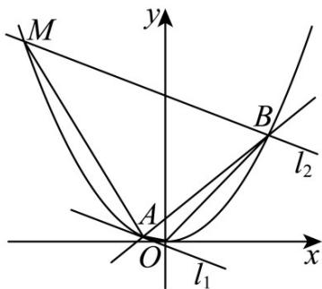

> [!faq]- 《专题03_抛物线的四大常考题型_高效培优专项训练_》官方解析
>
> > [!success]- **【答案】** (1) $x^{2}=4y$ (2)①证明见解析；②18
>
> > [!note]- **【解析】**
> > （1）依题意抛物线 $C: x^{2} = 2py (p > 0)$ 的焦点为 $F(0, \frac{p}{2})$ ，准线方程为 $y = -\frac{p}{2}$
> >
> > 则当直线 l 的倾斜角为 $\frac{\pi}{4}$ 时，直线 l 的方程为 $y = x + \frac{p}{2}$ ，
> >
> > 联立 $\left\{ \begin{array}{l} y = x + \frac{p}{2} \\ x^2 = 2py \end{array} \right.$ ，消去得 $x^2 - 2px - p^2 = 0$ ，则 $x_1 + x_2 = 2p, x_1x_2 = -p^2$
> >
> > 所以 $y_{1} + y_{2} = x_{1} + x_{2} + p = 3p$
> >
> > 由抛物线定义得 $\left|AB\right|=\left|AF\right|+\left|BF\right|=y_{1}+y_{2}+p=4p=8$
> >
> > 所以 $p = 2$ ，所以抛物线 $C$ 的方程为 $x^{2} = 4y$
> >
> > (2) ①证明：抛物线 C 的方程化为 $y = \frac{x^{2}}{4}$ ，则 $y' = \frac{1}{2}x$ ，
> >
> > 所以过点 A 的抛物线 C 的切线 $l_{1}$ 的方程为 $y=\frac{1}{2}x_{1}(x-x_{1})+y_{1}$
> >
> > 因为 $l_{2} / / l_{1}$ ，所以直线 $l_{2}$ 的方程为 $y - y_{2} = \frac{1}{2} x_{1}(x - x_{2})$
> >
> > 与抛物线 C 的方程联立并化简得 $x^{2}-2x_{1}x+2x_{1}x_{2}-4y_{2}=0$
> >
> > 因为直线 $l_{2}$ 交抛物线 C 于 B、M 两点，所以 $x_{2} + x_{3} = 2x_{1}$ ；
> >
> > 
> > - **②**：显然直线 $AB$ 的斜率存在，则设直线 $AB$ 的方程为 $y = kx + 1$
> >
> > 联立 $\left\{ \begin{array}{l} y = kx + 1 \\ x^2 = 4y \end{array} \right.$ ，消去 $y$ 得 $x^2 - 4kx - 4 = 0$ ，则 $x_1 + x_2 = 4k$ ， $x_1x_2 = -4$ ，
> >
> > 所以 $\left|AB\right|=\sqrt{1+k^{2}}\cdot\sqrt{(x_{1}+x_{2})^{2}-4x_{1}x_{2}}=\sqrt{1+k^{2}}\cdot\sqrt{16k^{2}+16}=4(1+k^{2})$
> >
> > 原点 O 到直线 AB 的距离 $d_{1}=\frac{1}{\sqrt{k^{2}+1}}$
> >
> > 由①得 $x_{2} + x_{3} = 2x_{1}$ ， $x_{2}x_{3} = 2x_{1}x_{2} - 4y_{2} = 2x_{1}x_{2} - x_{2}^{2}$
> >
> > 则 $|MB| = \sqrt{1 + \frac{1}{4} x_1^2} \cdot \sqrt{(x_2 + x_3)^2 - 4x_2x_3} = \sqrt{1 + \frac{1}{4} x_1^2} \cdot \sqrt{4x_1^2 - 8x_1x_2 + 4x_2^2}$
> >
> > $$
> > = \sqrt {1 + \frac {1}{4} x _ {1} ^ {2}} \cdot \sqrt {4 (x _ {1} + x _ {2}) ^ {2} - 1 6 x _ {1} x _ {2}} = \sqrt {1 + \frac {1}{4} x _ {1} ^ {2}} \cdot \sqrt {6 4 k ^ {2} + 6 4}
> > $$
> >
> > 点到的距离 $d_{2} = \frac{|-\frac{1}{2}x_{1}^{2} + y_{1} - (-\frac{1}{2}x_{1}x_{2} + y_{2})|}{\sqrt{\frac{1}{4}x_{1}^{2} + 1}} = \frac{|-\frac{1}{2}x_{1}^{2} + \frac{1}{4}x_{1}^{2} + \frac{1}{2}x_{1}x_{2} - \frac{1}{4}x_{2}^{2}|}{\sqrt{\frac{1}{4}x_{1}^{2} + 1}}$
> >
> > $$
> > = \frac {\left(x _ {1} - x _ {2}\right) ^ {2}}{4 \sqrt {\frac {1}{4} x _ {1} ^ {2} + 1}} = \frac {\left(x _ {1} + x _ {2}\right) ^ {2} - 4 x _ {1} x _ {2}}{4 \sqrt {\frac {1}{4} x _ {1} ^ {2} + 1}} = \frac {4 k ^ {2} + 4}{\sqrt {\frac {1}{4} x _ {1} ^ {2} + 1}}
> > $$
> >
> > 则四边形OBMA的面积 $S = S_{\triangle OAB} + S_{\triangle ABM} = \frac{1}{2}|AB|\cdot d_1 + \frac{1}{2}|MB|\cdot d_2$
> >
> > $$
> > = \frac {1}{2} \cdot 4 \left(1 + k ^ {2}\right) \cdot \frac {1}{\sqrt {k ^ {2} + 1}} + \frac {1}{2} \cdot \sqrt {1 + \frac {1}{4} x _ {1} ^ {2}} \cdot \sqrt {6 4 k ^ {2} + 6 4} \cdot \frac {4 k ^ {2} + 4}{\sqrt {\frac {1}{4} x _ {1} ^ {2} + 1}}
> > $$
> >
> > $$
> > = 2 \sqrt {1 + k ^ {2}} + 1 6 (\sqrt {1 + k ^ {2}}) ^ {3}
> > $$
> >
> > 令 $t = \sqrt{1 + k^2}$ ，则 $t = 1$ ，所以 $S = 2t + 16t^3$
> >
> > 则 $S' = 2 + 48t^2$ ，所以S关于 $t$ 的函数在 $\left[1, +\infty\right)$ 上单调递增，
> >
> > 所以当 t=1 ，即 k=0 时 S 有最小值，最小值为 18 .
