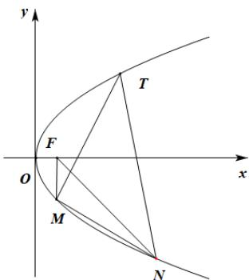

> [!faq]- 《专题03_抛物线的四大常考题型_高效培优专项训练_》官方解析
>
> > [!success]- **【答案】** (1) $y^{2}=4x$ (2) $P(-1,0)$ (3) $\frac{2\sqrt{5}}{5}$
>
> > [!note]- **【解析】**
> > （1）因为 $F(1,0)$ 为抛物线 $C:y^{2}=2px(p>0)$ 的焦点，故 $\frac{p}{2}=1$ ，故p=2，
> > 故 $y^{2}=4x$ .
> >
> > (2) 设 $P(t,0)$ ，设 $A\left(\frac{y_{1}^{2}}{4},y_{1}\right), B\left(\frac{y_{2}^{2}}{4},y_{2}\right)$ ，则 $\frac{y_{2}^{2}}{4}-t + \frac{y_{1}^{2}}{4}-t = 0$ ，
> >
> > 化简得 $\frac{y_{1}y_{2}}{4}(y_{1}+y_{2})-t(y_{1}+y_{2})=0$ .
> >
> > 设直线 $l$ 的方程为 $x = my + 1$ ，则由 $\left\{ \begin{array}{ll}x = my + 1\\ y^2 = 4x \end{array} \right.$ 可得 $y^{2} - 4my - 4 = 0$
> >
> > 故 $y_{1}y_{2} = -4, y_{1} + y_{2} = 4m$ ，故 $-4m - 4tm = 0$ ，由 $m$ 的任意性可得 $t = -1$ .
> >
> > 故存在 $P(-1,0)$ ，使得 $k_{AP} + k_{BP} = 0$ 。
> >
> > (3)
> >
> > 
> >
> > 设 $M\left(\frac{y_3^2}{4},y_3\right),N\left(\frac{y_4^2}{4},y_4\right)$ ，则 $k_{TM} = \frac{y_3 - 4}{\frac{y_3^2}{4} - 4} = \frac{4}{y_3 + 4}$
> >
> > 同理 $k_{TN}=\frac{4}{y_{4}+4}$ ， $k_{MN}=\frac{4}{y_{4}+y_{3}}$ ，
> >
> > 因为 $k_{TM} + k_{TN} = 0$ ，故 $\frac{4}{y_3 + 4} +\frac{4}{y_4 + 4} = 0$ ，故 $y_{3} + y_{4} = -8$ ，故 $k_{MN} = \frac{4}{y_4 + y_3} = -\frac{1}{2}$
> >
> > 设直线 $MN:x = -2y + n$ ，由 $\left\{ \begin{array}{l}x = -2y + n\\ y^2 = 4x \end{array} \right.$ 得 $y^{2} + 8y - 4n = 0$ ，故 $y_{3} + y_{4} = -8,y_{3}y_{4} = -4n$ ， $\Delta = 64 + 16n > 0$
> >
> > 故 $n > -4$ 而 $\frac{4}{y_3 + 4} >1$ ，故 $\frac{y_3}{y_3 + 4} < 0$ ，故 $-4 < y_3 < 0$
> >
> > 当直线 $MN$ 过 $(0,0)$ 时， $n = 0$ ，过 $(4, -4)$ 时， $n = -4$ ，故 $-4 < n < 0$
> >
> > 设 F 到直线 MN 的距离为 d，
> >
> > $$
> > \sin \angle F M N - \sin \angle F N M = \frac {d}{| F M |} - \frac {d}{| F N |} = d \times \frac {| F N | - | F M |}{| F M | | F N |} = \frac {| 1 - n |}{\sqrt {5}} \times \frac {\left(\frac {y _ {4} ^ {2}}{4} + 1\right) - \left(\frac {y _ {3} ^ {2}}{4} + 1\right)}{\left(\frac {y _ {4} ^ {2}}{4} + 1\right) \left(\frac {y _ {3} ^ {2}}{4} + 1\right)} = \frac {| 1 - n |}{\sqrt {5}} \times \frac {4 \left(y _ {4} ^ {2} - y _ {3} ^ {2}\right)}{\left(y _ {4} ^ {2} + 4\right) \left(y _ {3} ^ {2} + 4\right)}
> > $$
> >
> > $$
> > = \frac {\left| 1 - n \right|}{\sqrt {5}} \times \frac {4 \left(y _ {4} - y _ {3}\right) \left(y _ {4} + y _ {3}\right)}{y _ {3} ^ {2} y _ {4} ^ {2} + 4 \left(y _ {4} + y _ {3}\right) ^ {2} - 8 y _ {3} y _ {4} + 1 6} = \frac {\left| 1 - n \right|}{\sqrt {5}} \times \frac {3 2 \sqrt {6 4 + 1 6 n}}{1 6 n ^ {2} + 2 5 6 + 3 2 n + 1 6} = \frac {\left| 1 - n \right|}{\sqrt {5}} \times \frac {8 \sqrt {4 + n}}{n ^ {2} + 2 n + 1 7}
> > $$
> >
> > 设 $\sqrt{4+n}=s$ ，则 0<s<2 且 $n=s^{2}-4$ ，
> >
> > $$
> > \text {故} \sin \angle F M N - \sin \angle F N M = \frac {1}{\sqrt {5}} \times \frac {8 s \left| 5 - s ^ {2} \right|}{\left(s ^ {2} - 4\right) ^ {2} + 2 \left(s ^ {2} - 4\right) + 1 7} = \frac {1}{\sqrt {5}} \times \frac {8 s \left| 5 - s ^ {2} \right|}{s ^ {4} - 6 s ^ {2} + 2 5}
> > $$
> >
> > $$
> > = \frac {1}{\sqrt {5}} \times \frac {8 \left| \frac {5}{s} - s \right|}{s ^ {2} - 6 + \frac {2 5}{s ^ {2}}} = \frac {1}{\sqrt {5}} \times \frac {8 \left| \frac {5}{s} - s \right|}{\left(\frac {5}{s} - s\right) ^ {2} + 4} \leq \frac {2 \sqrt {5}}{5},
> > $$
> >
> > 当且仅当 $\left|\frac{5}{s} - s\right| = 2$ 即 $s = \sqrt{6} - 1$ 时等号成立，
> >
> > 故 $\sin \angle FMN - \sin \angle FNM$ 的最大值为 $\frac{2\sqrt{5}}{5}$
