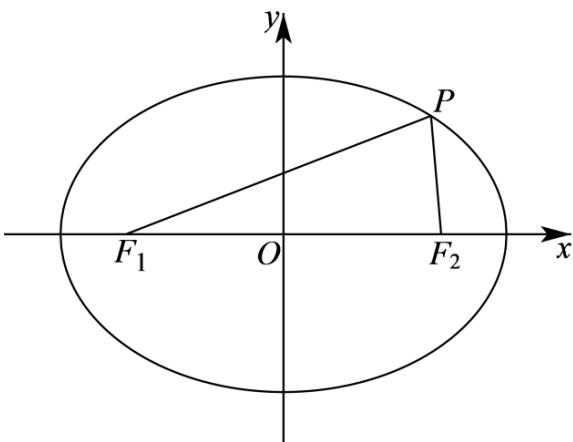

> [!faq]- 《专题01 椭圆的四大常考题型（高效培优专项训练）》官方解析
>
> > [!success]- **【答案】** A. $P$ 点纵坐标为 3 B. $\triangle F_1PF_2$ 的周长为 $4(\sqrt{2} + 1)$ C. $\cos \angle F_1PF_2 = \frac{7}{25}$ D. $\triangle F_1PF_2$ 的内切圆半径为 $\frac{3(\sqrt{2} - 1)}{2}$
>
> > [!note]- **【解析】**
> > 对于 A 选项，在椭圆 $E:\frac{x^{2}}{8}+\frac{y^{2}}{4}=1$ 中，∵ $a=2\sqrt{2}$ ，b=2，∴ $c=\sqrt{a^{2}-b^{2}}=2$ ，
> > ∴ $\left|F_{1}F_{2}\right|=2c=4$ ，则 $F_{1}(-2,0)$ 、 $F_{2}(2,0)$ ，
> >
> > 
> >
> > 设点 $P(m,n)$ ， $\therefore S_{\triangle F_1PF_2} = \frac{1}{2} \times |F_1F_2| \times |n| = 2|n| = 3$ ， $\therefore n = \pm \frac{3}{2}$ ，故选项A错误；
> >
> > 对于 $^{B}$ 选项，由椭圆的定义可知，
> >
> > $\Delta F_{1}PF_{2}$ 的周长为 $\left|PF_1\right| + \left|PF_2\right| + \left|F_1F_2\right| = 2a + 2c = 4\sqrt{2} +4 = 4\left(\sqrt{2} +1\right)$ ，故选项B正确；
> >
> > 对于 C 选项，设 $\angle F_{1}PF_{2} = \theta$ ， $S_{\triangle F_{1}PF_{2}} = \frac{1}{2}|PF_{1}| \cdot |PF_{2}| \sin \theta = 3$ ，可得 $|PF_{1}| \cdot |PF_{2}| \sin \theta = 6$ ，
> >
> > 由余弦定理可得 $\cos \theta = \frac{\left|PF_1\right|^2 + \left|PF_2\right|^2 - \left|F_1F_2\right|^2}{2\left|PF_1\right|\cdot\left|PF_2\right|} = \frac{\left(\left|PF_1\right| + \left|PF_2\right|\right)^2 - \left|F_1F_2\right|^2 - 2\left|PF_1\right|\cdot\left|PF_2\right|}{2\left|PF_1\right|\cdot\left|PF_2\right|}$
> >
> > $$
> > = \frac {4 a ^ {2} - 4 c ^ {2}}{2 \left| P F _ {1} \right| \cdot \left| P F _ {2} \right|} - 1 = \frac {2 b ^ {2}}{\left| P F _ {1} \right| \cdot \left| P F _ {2} \right|} - 1 = \frac {8}{\left| P F _ {1} \right| \cdot \left| P F _ {2} \right|} - 1
> > $$
> >
> > 所以 $\cos\theta=\frac{8}{\frac{6}{\sin\theta}}-1=\frac{4}{3}\sin\theta-1$
> >
> > 所以 $\left\{\begin{aligned}\cos\theta&=\frac{4}{3}\sin\theta-1\\ \cos^{2}\theta+\sin^{2}\theta&=1\\ \sin\theta&>0\end{aligned}\right.$ ，解得 $\left\{\begin{aligned}\sin\theta&=\frac{24}{25}\\ \cos\theta&=\frac{7}{25}\end{aligned}\right.$ ，故选项 C 正确，
> >
> > 对于 D 选项，设 $\triangle F_{1}PF_{2}$ 的内切圆半径为 r ，
> >
> > 则 $S_{\triangle F_1PF_2} = \frac{1}{2} r\cdot \left(\left|PF_1\right| + \left|PF_2\right| + \left|F_1F_2\right|\right) = \frac{1}{2} r\cdot \left(4\sqrt{2} +4\right) = 3$
> >
> > $\therefore r = \frac{3}{2(\sqrt{2} + 1)} = \frac{3}{2} (\sqrt{2} - 1)$ ，故选项D正确·
> >
> > 故选 **BCD**.
