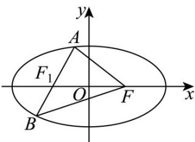

> [!faq]- 《专题01 椭圆的四大常考题型（高效培优专项训练）》官方解析
>
> > [!success]- **【答案】** 20
>
> > [!note]- **【解析】**
> > 如图，设 $F_{1}$ 为椭圆C的左焦点，
> >
> > 
> >
> > 则由椭圆的定义可得 $\triangle ABF$ 的周长为 $|AF| + |BF| + |AB| = 2a - |AF_1| + 2a - |BF_1| + |AB|$
> >
> > $$
> > = 4 a + | A B | - \left| A F _ {1} \right| - \left| B F _ {1} \right| = 2 0 + | A B | - \left| A F _ {1} \right| - \left| B F _ {1} \right|
> > $$
> >
> > 当 $A, B, F_{1}$ 共线时， $\left|AB\right| - \left|AF_{1}\right| - \left|BF_{1}\right| = 0$
> >
> > 当 $A, B, F_{1}$ 不共线时， $\left|AB\right| - \left|AF_{1}\right| - \left|BF_{1}\right| < 0$
> >
> > 所以 $\triangle ABF$ 周长的最大值为 20.
> >
> > 故答案为：20.
