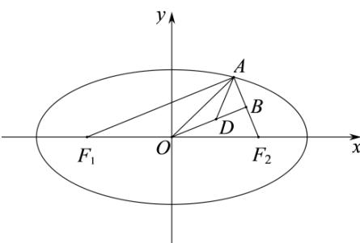
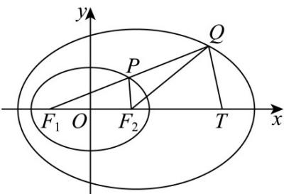

> [!faq]- 《专题01 椭圆的四大常考题型（高效培优专项训练）》官方解析
>
> > [!success]- **【答案】** $\frac{x^2}{9} +\frac{y^2}{3} = 1$
>
> > [!note]- **【解析】**
> > 
> >
> > 如图所示，不妨设 $\mathrm{A}$ 在第一象限，则 $\left|F_1F_2\right| = 2c$ ，因 $AF_{1}\perp AF_{2}$ ，则 $\left|OA\right| = \frac{1}{2}\left|F_1F_2\right| = c$
> >
> > 在 $\triangle OAF_{2}$ 中，因 $\left|OF_2\right| = \left|OA\right| = c$ ，且由 $2OB = OA + OF_{2}$ ，可知点 $B$ 是 $AF_{2}$ 的中点，
> >
> > 则得 $OB \perp AF_{2}$ ，且 $\left|F_{1}A\right| = 2\left|OB\right|$
> >
> > 因为 $AF_{1} \perp AF_{2}$ ， $AD$ 平分 $\angle F_{1}AF_{2}$ ，故 $\angle DAB = \frac{\pi}{4}$
> >
> > 故 $\triangle DBA$ 为等腰直角三角形， $|DB| = |BA| = \frac{1}{2}|AF_2|$
> >
> > 由题意知 $\left|OB\right|=\sqrt{3}+\left|DB\right|$ ，则 $\left|AF_{1}\right|=2\left|OB\right|=2\sqrt{3}+\left|AF_{2}\right|$ ，即 $\left|AF_{1}\right|-\left|AF_{2}\right|=2\sqrt{3}$
> >
> > 根据椭圆的定义可得 $\left|AF_1\right| + \left|AF_2\right| = 2a$
> >
> > 联立 $\left\{ \begin{array}{l} \left|AF_1\right| - \left|AF_2\right| = 2\sqrt{3}\\ \left|AF_1\right| + \left|AF_2\right| = 2a \end{array} \right.$ ，解得 $\left\{ \begin{array}{l}\left|AF_1\right| = a + \sqrt{3}\\ \left|AF_2\right| = a - \sqrt{3} \end{array} \right.,$
> >
> > 在直角 $\triangle AF_1F_2$ 中 $\left|AF_1\right|^2 +\left|AF_2\right|^2 = (2c)^2$ ，即 $\left(a + \sqrt{3}\right)^2 +\left(a - \sqrt{3}\right)^2 = 4c^2$
> >
> > 化简得 $a^2 - 2c^2 = -3$ ，又因 $a^2 = 3 + c^2$ ，两者联立解得 $a^2 = 9$
> >
> > 故椭圆标准方程为 $\frac{x^{2}}{9}+\frac{y^{2}}{3}=1$ .
> >
> > 故答案为： $\frac{x^{2}}{9}+\frac{y^{2}}{3}=1$
> >
> > 6. 椭圆 $E: \frac{x^2}{2} + y^2 = 1$ 的左、右焦点分别为 $F_1, F_2$ ，点 $P$ 为椭圆 $E$ 上一动点，延长 $F_1P$ 到点 $Q$ ，使得 $P$ 为线段 $F_1Q$ 的中点，则 $\left|QF_2\right|$ 的最小值为（）
> >
> > 【答案】
> >
> > A. 1 B. 2 C. $\sqrt{2}$ D. 4
> >
> > 【答案】B
> >
> > 【详解】
> >
> > 
> >
> > 由题意得 $\left|F_{1}F_{2}\right|=2$ ，记点 $T(3,0)$ ，则 $\left|F_{2}T\right|=2$ ，即 $F_{2}$ 为线段 $F_{1}T$ 的中点，
> >
> > $P$ 为线段 $F_{1}Q$ 的中点，则在 $\triangle QF_{1}T$ 中， $|QT| = 2|PF_{2}|$ ， $|QF_{1}| = 2|PF_{1}|$ ，
> >
> > 则 $\left|QT\right| + \left|QF_{1}\right| = 4\sqrt{2} > \left|F_{1}T\right|$ ，所以动点 $Q$ 的轨迹为以 $T$ ， $F_{1}$ 为焦点的椭圆，
> >
> > 其焦距为 $\left|F_1T\right| = 4$ ，长轴长为 $\left|QT\right| + \left|QF_1\right| = 4\sqrt{2}$ ，短半轴长为 $\sqrt{\left(\frac{4\sqrt{2}}{2}\right)^2 - \left(\frac{4}{2}\right)^2} = 2$
> >
> > 可得 $\left|QF_{2}\right|$ 的最小值为2.
> >
> > 故选 **B**.
