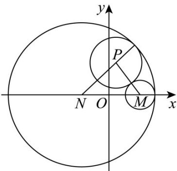
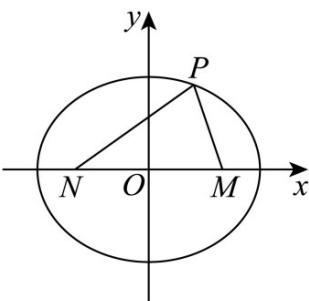

> [!faq]- 《专题01 椭圆的四大常考题型（高效培优专项训练）》官方解析
>
> > [!success]- **【答案】** (1) $\frac{x^{2}}{12}+\frac{y^{2}}{4}=1$ (2) $b = \frac{\sqrt{6}}{2}$
>
> > [!note]- **【解析】**
> > （1）已知 $\left|F_{1}F_{2}\right|=4\sqrt{2}$ ，因为 $\left|F_{1}F_{2}\right|=2c$ ，所以 $c=2\sqrt{2}$ ，
> >
> > 点 $P(-3,1)$ 在椭圆上，将其代入椭圆的 $\frac{x^2}{a^2} +\frac{y^2}{b^2} = 1(a > b > 0)$
> >
> > 可得 $\frac{(-3)^2}{a^2} +\frac{1^2}{b^2} = 1$ ，即 $\frac{9}{a^2} +\frac{1}{b^2} = 1①$
> >
> > 又因为 $c^{2}=a^{2}-b^{2}$ ，即 $a^{2}-b^{2}=8$ ②，
> >
> > 联立①②，整理得 $b^{4}-2b^{2}-8=0$ ，解得 $b^{2}=4$ 或 $b^{2}=-2$
> >
> > 因为 $b^{2} > 0$ ，所以 $b^{2} = 4$ ，
> >
> > 所以 $a^{2}=b^{2}+c^{2}=4+8=12$
> >
> > 故椭圆 C 的标准方程为 $\frac{x^{2}}{12} + \frac{y^{2}}{4} = 1$ ;
> >
> > (2) 因为 $\angle F_{1}PF_{2}=\frac{\pi}{3}$ ，所以 $\triangle F_{1}PF_{2}$ 的面积 $S=\frac{1}{2}\left|PF_{1}\right|\left|PF_{2}\right|\sin\frac{\pi}{3}=\frac{\sqrt{3}}{2}$
> >
> > 则 $\left|PF_{1}\right|\left|PF_{2}\right|=2$
> >
> > 因为长轴长为 $2a = 2\sqrt{6}$ ，即 $a = \sqrt{6}$
> >
> > 根据椭圆的定义得 $\left|PF_{1}\right|+\left|PF_{2}\right|=2\sqrt{6}$
> >
> > 所以 $\left(\left|PF_1\right| + \left|PF_2\right|\right)^2 = 24$ ，即 $\left|PF_1\right|^2 +\left|PF_2\right|^2 +2\left|PF_1\right|\left|PF_2\right| = 24$ ③，
> >
> > 由余弦定理可得 $\left|F_{1}F_{2}\right|^{2}=\left|PF_{1}\right|^{2}+\left|PF_{2}\right|^{2}-2\left|PF_{1}\right|\left|PF_{2}\right|\cos\frac{\pi}{3}$ ，
> >
> > 整理得 $\left|F_{1}F_{2}\right|^{2}=\left|PF_{1}\right|^{2}+\left|PF_{2}\right|^{2}-\left|PF_{1}\right|\left|PF_{2}\right|$ ④，
> >
> > 联立③④得： $\left|F_1F_2\right|^2 - 24 = -3\left|PF_1\right|\left|PF_2\right|$ ，即 $\left|F_1F_2\right|^2 = 18$
> >
> > 则 $\left|F_{1}F_{2}\right|=3\sqrt{2}$ ，所以 $c=\frac{3\sqrt{2}}{2}$ ，
> >
> > 在椭圆中有 $b^{2}=a^{2}-c^{2}$ ，即 $b^{2}=\left(\sqrt{6}\right)^{2}-\left(\frac{3\sqrt{2}}{2}\right)^{2}=\frac{3}{2}$ ，
> >
> > 解得 $b=\frac{\sqrt{6}}{2}$ .
> >
> > 10．平面直角坐标系中，圆 M 的方程为 $(x-2)^{2}+y^{2}=1$ ，圆 N 的方程为 $(x+2)^{2}+y^{2}=25$ ，动圆 P 与圆 N 内切，与圆 M 外切·
> >
> > (1)求动圆 P 的圆心的轨迹方程；
> >
> > (2) 当 $\left|PM\right|\cdot\left|PN\right|=\frac{20}{3}$ 时，求 $\angle MPN$ 的大小.
> >
> > 【答案】(1) $\frac{x^{2}}{9}+\frac{y^{2}}{5}=1(x\neq3)$ ;
> >
> > (2) $\frac{\pi}{3}$ .
> >
> > 【详解】（1）圆 M 的圆心为 $M(2,0)$ ，半径为 $r_{1}=1$ ，
> >
> > 圆 N 的圆心为 $N(-2,0)$ ，半径为 $r_{2}=5$ 。
> >
> > 设动圆 P 的圆心为 $P(x,y)$ ，半径为 r，
> >
> > 则依题意得 $\left|NP\right|=5-r$ ， $\left|MP\right|=1+r$ ，
> >
> > 所以 $\left|NP\right|+\left|MP\right|=6>4=\left|MN\right|$
> >
> > 所以，点 P 的轨迹为椭圆，焦点在 x 轴上，其中 $2a = 6, 2c = 4$ ，故 $b^{2} = 3^{2} - 2^{2} = 5$ ，
> >
> > 所以，动圆 P 的圆心的轨迹方程为 $\frac{x^{2}}{9} + \frac{y^{2}}{5} = 1$ .
> >
> > 由图可知，当 $x = 3$ 时，不符合题意，故椭圆方程为 $\frac{x^2}{9} +\frac{y^2}{5} = 1(x\neq 3)$
> >
> > 
> >
> > (2) 记 $\left|NP\right|=n,\left|MP\right|=m$ ， $\angle MPN=\theta$
> >
> > 由（1）知， $m+n=6$ ，
> >
> > 由余弦定理可得 $m^2 + n^2 - 2mn\cos \theta = |MN|^2 = 16$
> >
> > 整理得 $(m+n)^{2}-2mn-2mn\cos\theta=16$ ，即 $mn+mn\cos\theta=10$ ，
> >
> > 又 $\left|PM\right|\cdot\left|PN\right|=mn=\frac{20}{3}$ ，所以 $\frac{20}{3}+\frac{20}{3}\cos\theta=10$ ，解得 $\cos\theta=\frac{1}{2}$ ，
> >
> > 因为 $\theta\in(0,\pi)$ ，所以 $\angle MPN=\theta=\frac{\pi}{3}$ .
> >
> > 
