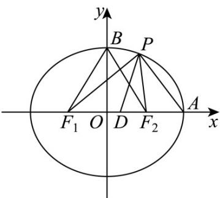

> [!faq]- 《专题01 椭圆的四大常考题型（高效培优专项训练）》官方解析
>
> > [!success]- **【答案】** A. 椭圆 $C$ 的离心率为 $\frac{3}{5}$ B. 存在点 $P$ ，使得 $\angle F_{1}PF_{2} = \frac{\pi}{2}$ C. $|PD|$ 的最大值为 6 D. $PF_{1} \cdot PA$ 的取值范围为 $\left[-\frac{16}{9}, 20\right]$
>
> > [!note]- **【解析】**
> > 
> >
> > 对于 $^{A}$ ，由题知a=5， $c=\sqrt{25-16}=3$ ，所以椭圆C的离心率为 $\frac{c}{a}=\frac{3}{5}$ ，故 $^{A}$ 正确；
> >
> > 对于 $\mathsf{B}$ ，设上顶点为 $B$ ， $\sin \angle F_1BO = \frac{c}{a} = \frac{3}{5} < \frac{\sqrt{2}}{2}$ ，即 $\angle F_{1}BO <   \frac{\pi}{4}$ ，所以 $\angle F_1BF_2 <   \frac{\pi}{2}$
> >
> > 所以不存在点 $P$ ，使得 $\angle F_{1}PF_{2} = \frac{\pi}{2}$ ，故B错误；
> >
> > 对于 $\mathbb{C}$ ，设 $P(x,y)(-5\leq x\leq 5)$ ，由题知 $A(5,0)$ ， $F_{1}(-3,0)$ ，所以 $D(1,0)$
> >
> > 所以 $\left|PD\right|=\sqrt{(x-1)^{2}+y^{2}}=\sqrt{x^{2}-2x+1+16-\frac{16x^{2}}{25}}=\sqrt{\frac{9}{25}\left(x-\frac{25}{9}\right)^{2}+\frac{128}{9}}$
> >
> > 所以当 $x = -5$ 时， $\left|PD\right|_{\max} = 6$ ，故C正确；
> >
> > 对于 D， $PF_{1} \cdot PA = (PD + DF_{1}) \cdot (PD + DA) = PD^{2} - DA^{2}$
> >
> > 由 C 选项得 $\overrightarrow{PF_{1}}\cdot\overrightarrow{PA}=\frac{9}{25}\left(x-\frac{25}{9}\right)^{2}-\frac{16}{9}$
> >
> > 所以当 x = -5 时， $PF_{1} \cdot PA$ 取得最大值 20，
> >
> > 当 $x = \frac{25}{9}$ 时， $PF_{1} \cdot PA$ 取得最小值 $-\frac{16}{9}$
> >
> > 所以 $PF_{1} \cdot PA$ 的取值范围为 $\left[-\frac{16}{9}, 20\right]$ ，故 $D$ 正确.
> >
> > 故选 **ACD**.
