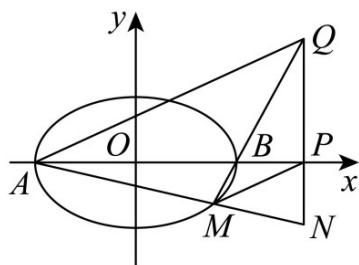

> [!faq]- 《专题01 椭圆的四大常考题型（高效培优专项训练）》官方解析
>
> > [!success]- **【答案】** (1) $\frac{x^{2}}{4}+\frac{y^{2}}{3}=1$ (2)存在， $\left(5,\frac{\sqrt{21}}{2}\right)$ 或 $\left(5, - \frac{\sqrt{21}}{2}\right)$
>
> > [!note]- **【解析】**
> > （1）由题意知 $c = 1$ ，且过点 $(\sqrt{3},\frac{\sqrt{3}}{2})$ ，即 $a^2 -b^2 = 1$ ， $\frac{3}{a^2} +\frac{3}{4b^2} = 1$ ，解得 $a^2 = 4$ ， $b^{2} = 3$ ，所以椭圆的方程为 $\frac{x^2}{4} +\frac{y^2}{3} = 1$ ；
> >
> > (2) 假设存在点 $Q$ ，使得 $\angle QAN = \angle PMN$ ，则 $AQ //PM, \therefore k_{AQ} = k_{PM}$
> >
> > 设 $Q(5,y_0),M(x_1,y_1)$ ，则 $k_{AQ} = \frac{y_0}{7},k_{PM} = \frac{y_1}{x_1 - 5},k_{BQ} = \frac{y_0}{3}$
> >
> > $\therefore \frac{y_0}{7} = \frac{y_1}{x_1 - 5}$ ，直线 $BQ$ 的方程为 $y = \frac{y_0}{3} (x - 2)$
> >
> > ∵点 $M(x_{1},y_{1})$ 在直线 BQ 上，∴ $y_{1}=\frac{y_{0}}{3}(x_{1}-2),\therefore\frac{y_{0}}{7}=\frac{\frac{y_{0}}{3}(x_{1}-2)}{x_{1}-5}$
> >
> > ∵点Q是直线x=5上不同于点P的一点，∴ $y_{0}\neq0,\therefore\frac{1}{7}=\frac{x_{1}-2}{3(x_{1}-5)}$ ，解得 $x_{1}=-\frac{1}{4}$
> >
> > ∵点 $M(x_{1},y_{1})$ 在椭圆 C 上，∴ $\frac{1}{64} + \frac{y_{1}^{2}}{3} = 1$ ，解得 $y_{1} = \frac{3\sqrt{21}}{8}$ 或 $y_{1} = -\frac{3\sqrt{21}}{8}$ ，
> >
> > 当 $y_{1} = \frac{3\sqrt{21}}{8}$ 时，解得 $y_{0} = -\frac{\sqrt{21}}{2}$ ；当 $y_{1} = -\frac{3\sqrt{21}}{8}$ 时，解得 $y_{0} = \frac{\sqrt{21}}{2}$
> >
> > $\therefore$ 存在点 $Q$ ，使得 $\angle QAN = \angle PMN$ ，点 $Q$ 的坐标为 $\left(5, \frac{\sqrt{21}}{2}\right)$ 或 $\left(5, -\frac{\sqrt{21}}{2}\right)$
> >
> > 
