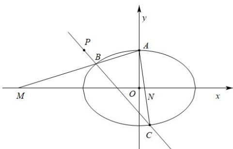
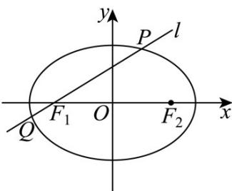

> [!faq]- 《专题01 椭圆的四大常考题型（高效培优专项训练）》官方解析
>
> > [!success]- **【答案】** (1)长轴长为 $6$ ，离心率为 $\frac{\sqrt{5}}{3}$ (2)证明见解析
>
> > [!note]- **【解析】**
> > （1）由椭圆方程 $\frac{x^2}{9} +\frac{y^2}{4} = 1$ 得， $a = 3$ ， $b = 2$
> >
> > 所以 $c=\sqrt{a^{2}-b^{2}}=\sqrt{5}$
> >
> > 所以 $2a=6$ ， $\frac{c}{a}=\frac{\sqrt{5}}{3}$ ;
> >
> > 所以椭圆长轴长为 $6$ ，离心率为 $\frac{\sqrt{5}}{3}$
> >
> > (2) 设点 $B(x_{1}, y_{1})$ , $C(x_{2}, y_{2})$ , $M(m, 0)$ , $N(n, 0)$ ,
> >
> > 设直线 $BC: y - 2 = k(x + 3)$ ，联立方程
> >
> > $$
> > \left\{ \begin{array}{l} \frac {x ^ {2}}{9} + \frac {y ^ {2}}{4} = 1 \\ y = k x + 3 k + 2 \end{array} \right.
> > $$
> >
> > 消去 $y$ 可得： $\left(9k^2 +4\right)x^2 +18k(3k + 2)x + 9(3k + 2)^2 -36 = 0$
> >
> > 则 $x_{1} + x_{2} = -\frac{18k(3k + 2)}{9k^{2} + 4}$ ； $x_{1}x_{2} = \frac{9(3k + 2)^{2} - 36}{9k^{2} + 4} = \frac{81k^{2} + 108k}{9k^{2} + 4}$ ；
> >
> > 椭圆上顶点 A 坐标为 $(0,2)$ ，
> >
> > 所以直线 $AB: y = \frac{y_{1} - 2}{x_{1}} x + 2$ ；直线 $AC: y = \frac{y_{2} - 2}{x_{2}} x + 2$ ；
> >
> > 将 $M(m,0)$ ， $N(n,0)$ 分别代入直线 AB、AC
> >
> > 解得 $m = -\frac{2x_{1}}{y_{1}-2}$ ; $n = -\frac{2x_{2}}{y_{2}-2}$ ;
> >
> > 所以 $m+n=-\frac{2x_{1}}{y_{1}-2}-\frac{2x_{2}}{y_{2}-2}=-\frac{2x_{1}}{kx_{1}+3k}-\frac{2x_{2}}{kx_{2}+3k}=-\frac{2}{k}\left(\frac{x_{1}}{x_{1}+3}+\frac{x_{2}}{x_{2}+3}\right)$
> >
> > 所以 $m+n=-\frac{2}{k}\cdot\frac{x_{1}(x_{2}+3)+x_{2}(x_{1}+3)}{(x_{1}+3)(x_{2}+3)}=-\frac{2}{k}\cdot\frac{2x_{1}x_{2}+3(x_{1}+x_{2})}{x_{1}x_{2}+3(x_{1}+x_{2})+9}$
> >
> > 将 $x_{1} + x_{2} = -\frac{18k(3k + 2)}{9k^{2} + 4}$ 、 $x_{1}x_{2} = \frac{9(3k + 2)^{2} - 36}{9k^{2} + 4} = \frac{81k^{2} + 108k}{9k^{2} + 4}$ 代入
> >
> > 解得 $m + n = -6$ ，得证.
> >
> > 
> >
> > 30. 椭圆 $\Gamma: \frac{x^2}{a^2} + \frac{y^2}{b^2} = 1 (a > b > 0)$ 的左、右焦点分别为 $F_1(-c, 0), F_2(c, 0) (c > 0)$ ，过点 $F_1$ 的直线 $l$ 与 $\Gamma$ 交于点 $P$ .
> >
> > (1)若 $c = 2$ ，点 $P$ 的坐标为 $(2,\sqrt{2})$ ，求点 $F_{2}$ 到直线 $l$ 的距离；
> >
> > (2) 当 $b \leq c$ 时，求满足 $PF_{1} \perp PF_{2}$ 的点 $P$ 的个数；
> >
> > (3)设直线 $l$ 与 $\Gamma$ 的另一个交点为 $Q$ ， $F_{1}Q = \lambda Q P (\lambda \in \mathbf{R})$ ，点 $P$ 的横坐标为 $\frac{c}{2}$ ，若 $\Gamma$ 的离心率 $e > \frac{1}{2}$ ，求 $\lambda$ 的取值范围。
> >
> > 【答案】 $(1)\frac{4}{3}$ ;
> >
> > (2)答案见解析；
> >
> > (3) $-\frac{1}{3}<\lambda<0$
> >
> > 【详解】（1）依题意， $F_{1}(-2,0), F_{2}(2,0)$ ，而 $P(2,\sqrt{2})$ ，则直线l的方程为 $y=\frac{\sqrt{2}}{4}(x+2)$
> >
> > 即 $x - 2\sqrt{2} y + 2 = 0$ ，所以点 $F_{2}$ 到直线 $l$ 的距离 $d = \frac{|2 - 2\sqrt{2}\times 0 + 2|}{\sqrt{1^2 + (-2\sqrt{2})^2}} = \frac{4}{3}.$
> >
> > (2) 由 $PF_{1} \perp PF_{2}$ ，得点 $P$ 在以线段 $F_{1}F_{2}$ 为直径的圆 $x^{2} + y^{2} = c^{2}$ 上， $c^{2} = a^{2} - b^{2}$
> >
> > 由 $\left\{ \begin{array}{l}x^{2} + y^{2} = c^{2}\\ b^{2}x^{2} + a^{2}y^{2} = a^{2}b^{2} \end{array} \right.$ 消去 $y$ 得 $(a^2 -b^2)x^2 = a^2 (c^2 -b^2)$ ，即 $c^2 x^2 = a^2 (c^2 -b^2)$
> >
> > 当 $b = c$ 时， $x = 0$ ， $y = \pm b$ ，因此点 $P(0, \pm b)$ ，共2个；
> >
> > 当 $b < c$ 时， $c^2 x^2 = a^2 (c^2 - b^2)$ ，解得 $x^2 = \frac{a^2(c^2 - b^2)}{c^2}$ ， $y^2 = \frac{b^4}{c^2}$ ，
> >
> > 因此点 $P(\pm \frac{a\sqrt{c^2 - b^2}}{c}, \pm \frac{b^2}{c})$ ，共4个，
> >
> > 所以当 b=c 时，点 P 的个数为 2；当 b<c 时，点 P 的个数为 4.
> >
> > (3) 设 $P\left(\frac{c}{2}, y_{P}\right), Q\left(x_{Q}, y_{Q}\right)$ ，由 $F_{1}Q = \lambda Q P$ ，且 $F_{1}$ 在线段 $PQ$ 上，得 $-1 < \lambda < 0$ ，
> >
> > 则 $(x_{Q} + c, y_{Q}) = \lambda \left(\frac{c}{2} - x_{Q}, y_{P} - y_{Q}\right)$ ，解得 $\left\{ \begin{array}{l} x_{Q} = \frac{c}{2} \cdot \frac{\lambda - 2}{\lambda + 1} \\ y_{Q} = \frac{\lambda}{\lambda + 1} y_{P} \end{array} \right.$ ，而 $e = \frac{c}{a}$ ，
> >
> > 由点 在 上，得 $\left\{ \begin{array}{l} \frac{c^2}{4a^2} + \frac{y_P^2}{b^2} = 1 \\ \frac{c^2(\lambda - 2)^2}{4a^2(\lambda + 1)^2} + \frac{\lambda^2}{(\lambda + 1)^2} \cdot \frac{y_P^2}{b^2} = 1 \end{array} \right.$ ，即 $\left\{ \begin{array}{l} \frac{e^2}{4} + \frac{y_P^2}{b^2} = 1 \\ \frac{e^2(\lambda - 2)^2}{4\lambda^2} + \frac{y_P^2}{b^2} = \frac{(\lambda + 1)^2}{\lambda^2} \end{array} \right.$ ，
> >
> > 整理得 $e^2 (-\lambda +1) = 2\lambda +1$ ，即 $e^2 = \frac{2\lambda + 1}{-\lambda + 1}$ ，由 $e > \frac{1}{2}$ ，得 $\frac{1}{4} < \frac{2\lambda + 1}{-\lambda + 1} < 1$ ，解得 $-\frac{1}{3} < \lambda < 0$ 所以 $\lambda$ 的取值范围是 $-\frac{1}{3} < \lambda < 0$
> >
> > 
