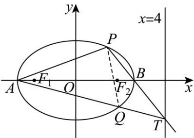

> [!faq]- 《专题01 椭圆的四大常考题型（高效培优专项训练）》官方解析
>
> > [!success]- **【答案】** (1) $\frac{x^{2}}{4}+y^{2}=1.$ (2) (i) 证明见解析；(ii) 证明见解析，定点 $(10)$ .
>
> > [!note]- **【解析】**
> > （1）由题意可知， $\left|NE\right|+\left|NF\right|=\left|NM\right|+\left|NE\right|=4>\left|EF\right|=2\sqrt{3}$
> >
> > 由椭圆定义可得，点 $N$ 的轨迹是以 $E$ ， $F$ 为焦点的椭圆，
> >
> > 且长轴长 $2a = 4$ ，焦距 $2c = |EF| = 2\sqrt{3}$
> >
> > 所以 $b^{2} = a^{2} - c^{2} = 1$
> >
> > 因此曲线 C 方程为 $\frac{x^{2}}{4} + y^{2} = 1$ .
> >
> > (2) 证明：(i) 设 $P(x_{1}, y_{1})$ ， $Q(x_{2}, y_{2})$ ， $T(4, m)$ ，
> >
> > 由题可知 $A(-20)$ ， $B(20)$ ，如下图所示，
> >
> > 则 $k_{AP}=\frac{y_{1}}{x_{1}+2}$ ， $k_{AQ}=k_{AT}=\frac{m-0}{4-(-2)}=\frac{m}{6}$ ，
> >
> > 而 $k_{BP} = k_{BT} = \frac{y_1}{x_1 - 2} = \frac{m}{2}$ ，于是 $m = \frac{2y_1}{x_1 - 2}$
> >
> > 所以 $k_{AP} \cdot k_{AQ} = \frac{y_{1}}{x_{1} + 2} \times \frac{m}{6} = \frac{y_{1}}{x_{1} + 2} \times \frac{y_{1}}{3(x_{1} - 2)} = \frac{y_{1}^{2}}{3(x_{1}^{2} - 4)}$
> >
> > 又 $\frac{x_1^2}{4} + y_1^2 = 1$ ，则 $y_1^2 = \frac{1}{4}\left(4 - x_1^2\right)$ ，
> >
> > 因此 $k_{AP} \cdot k_{AQ} = \frac{\frac{1}{4}\left(4 - x_1^2\right)}{3\left(x_1^2 - 4\right)} = -\frac{1}{12}$ 为定值；
> >
> > (ii) 由题意可知，直线 $PQ$ 不可能与 $x$ 轴平行，
> >
> > 设直线 PQ 的方程为 $x = ty + n$ ， $P(x_{1}, y_{1})$ ， $Q(x_{2}, y_{2})$ ，易知 n > 0
> >
> > 由 $\left\{\begin{aligned}x&=ty+n\\ &\frac{x^{2}}{4}+y^{2}&=1\end{aligned}\right.$ ，得 $\left(t^{2}+4\right)y^{2}+2tny+n^{2}-4=0$
> >
> > $\Delta = (2tn)^{2} - 4(t^{2} + 4)(n^{2} - 4) > 0$ ，得 $t^2 - n^2 - 4 > 0$
> >
> > 所以 $\left\{ \begin{array}{l} y_{1} + y_{2} = -\frac{2tn}{t^{2} + 4} \\ y_{1}y_{2} = \frac{n^{2} - 4}{t^{2} + 4} \end{array} \right.$ (\*)
> >
> > 由(i)可知， $k_{AP} \cdot k_{AQ} = -\frac{1}{12}$ ，
> >
> > $$
> > \frac {y _ {1}}{x _ {1} + 2} \cdot \frac {y _ {2}}{x _ {2} + 2} = \frac {y _ {1} y _ {2}}{(t y _ {1} + n + 2) (t y _ {2} + n + 2)} = \frac {y _ {1} y _ {2}}{t ^ {2} y _ {1} y _ {2} + t (n + 2) (y _ {1} + y _ {2}) + (n + 2) ^ {2}} = - \frac {1}{1 2}
> > $$
> >
> > 将 $(*)$ 代入化简得 $\frac{n^2 - 4}{4n^2 + 16n + 16} = -\frac{1}{12}$ ，解得 $n = 1$ 或 $n = -2$ （舍去），
> >
> > 所以直线 $PQ$ 的方程为 $x = ty + 1$
> >
> > 因此直线 PQ 经过定点 $(10)$ .
> >
> > 
