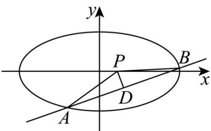

> [!faq]- 《专题01 椭圆的四大常考题型（高效培优专项训练）》官方解析
>
> > [!success]- **【答案】** (1) $\frac{x^{2}}{4}+y^{2}=1(x\neq\pm2)$ (2) $k = \pm \frac{\sqrt{2}}{4}.$
>
> > [!note]- **【解析】**
> > （1）设 $T(x,y)$
> >
> > 因为 $M(-2,0)$ ， $N(2,0)$ ，所以 $k_{MT}=\frac{y}{x+2}(x\neq-2)$ ， $k_{NT}=\frac{y}{x-2}(x\neq2)$ ，
> >
> > 由 $k_{MT} \cdot k_{NT} = -\frac{1}{4}$ ，得 $\frac{y}{x + 2} \times \frac{y}{x - 2} = -\frac{1}{4}$ ，整理得 $\frac{x^2}{4} + y^2 = 1$
> >
> > 则点 T 的轨迹 $\Gamma$ 的方程为 $\frac{x^{2}}{4} + y^{2} = 1 (x \neq \pm 2)$ .
> >
> > (2)
> >
> > 
> >
> > 设直线 l 的方程为 $y = k(x - \sqrt{3})$ ， $A(x_{1}, y_{1})$ ， $B(x_{2}, y_{2})$ ，
> >
> > 联立 $\left\{ \begin{array}{l} x^{2} + 4y^{2} = 4 \\ y = k(x - \sqrt{3}) \end{array} \right.$ ，消去 $y$ 并整理得 $\left(4k^{2} + 1\right)x^{2} - 8\sqrt{3}k^{2}x + 12k^{2} - 4 = 0$
> >
> > 此时 $\Delta > 0$
> >
> > 由韦达定理得 $x_{1} + x_{2} = \frac{8\sqrt{3}k^{2}}{4k^{2} + 1}$
> >
> > 所以 $y_{1} + y_{2} = k\left(x_{1} + x_{2} - 2\sqrt{3}\right) = \frac{-2\sqrt{3}k}{4k^{2} + 1}$
> >
> > 此时 $AB$ 中点 $D\left(\frac{4\sqrt{3}k^2}{4k^2 + 1}, \frac{-\sqrt{3}k}{4k^2 + 1}\right)$
> >
> > 因为 $\left|PA\right|=\left|PB\right|$ ，所以直线 PD 与直线 AB 垂直，
> >
> > 所以，即 $\frac{\frac{-\sqrt{3}k}{4k^2 + 1}}{\frac{4\sqrt{3}k^2}{4k^2 + 1} - \frac{\sqrt{3}}{4}}\times k = -1$ $k_{PD}\cdot k = -1$
> >
> > 解得 $k^2 = \frac{1}{8}$
> >
> > 则 $k = \pm \frac{\sqrt{2}}{4}$ .
