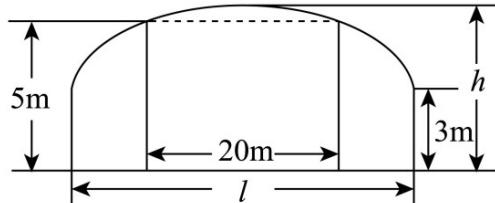

<!-- question-source:start -->
40．如图，某隧道设计为双向四车道，车道总宽20米，要求通行车辆限高5米，隧道全长2500米．隧道

的两侧是与地面垂直的墙，高度为 $^{3}$ 米，隧道上部拱线近似地看成半个椭圆。

(1)若最大拱高 $h$ 为6米，则隧道设计的拱宽 $l$ 是多少？（结果精确到0.1米）

(2)若要使隧道上方半椭圆部分的土方工程量最小，则应如何设计拱高 h 和拱宽 $l^{?}$ （结果精确到 0.1 米）

以下结论可以直接使用：①椭圆 $\frac{x^{2}}{a^{2}} + \frac{y^{2}}{b^{2}} = 1$ 的面积公式 $S = \pi ab$ .

②柱体的体积为底面积乘以高， $\sqrt{5} \approx 2.236$ ， $\sqrt{2} \approx 1.414$ 。
<!-- question-source:end -->

![[高中/课堂同步/题库/人教A版高中数学同步讲义(2026)/03_选择性必修第一册/第三章 圆锥曲线的方程/专题01 椭圆的四大常考题型（高效培优专项训练）/题型四_椭圆的实际问题/questions/answers/Q00080046A1.md]]
