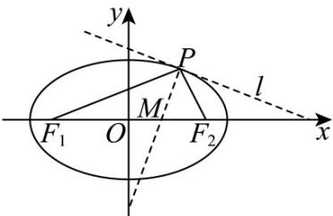
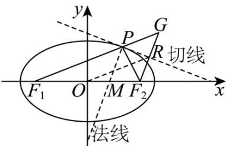
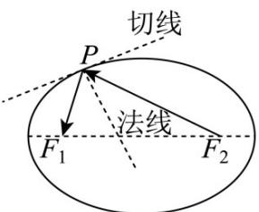
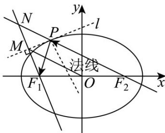

> [!faq]- 《专题01 椭圆的四大常考题型（高效培优专项训练）》官方解析
>
> > [!success]- **【答案】**  A. $\triangle PF_{1}F_{2}$ 面积的最大值为 $\sqrt{3}$ B. $|PQ| + |PF_2|$ 的最大值为8 C. 若 $|PM| = |MF_2|$ ，则 $|PF_1| = 3|PF_2|$ D. 若 $F_{2}R \perp l$ ，垂足为 $R(x_0, y_0)$ ，则 $x_0^2 + y_0^2 = 4$
>
> > [!note]- **【解析】**
> > 由椭圆方程可知： $a = 2$ ， $b = 1$ ， $c = \sqrt{a^2 - b^2} = \sqrt{3}$
> >
> > 对于 $^{A}$ ：当点P为短轴顶点时， $\triangle PF_{1}F_{2}$ 面积的最大，最大值为 $\frac{1}{2}\times2\sqrt{3}\times1=\sqrt{3}$ ，故 $^{A}$ 正确；
> >
> > 对于 B：因为 $\left|PF_{1}\right|+\left|PF_{2}\right|=2a=4$ ，则 $\left|PF_{2}\right|=4-\left|PF_{1}\right|$
> >
> > 可得 $\left|PQ\right| + \left|PF_{2}\right| = 4 + \left|PQ\right| - \left|PF_{1}\right| \leq 4 + \left|F_{1}Q\right| = 4 + \sqrt{c^{2} + 6} = 7$
> >
> > 当且仅当 P 为线段 $QF_{1}$ 与椭圆的交点时，取到最大，
> >
> > 所以 $\left|PQ\right|+\left|PF_{2}\right|$ 的最大值为 7，故 B 错误；
> >
> > 对于 $\mathbb{C}$ ：由椭圆的光学性质，得点 $P$ 与 $l$ 垂直的直线为角 $\angle F_{1}PF_{2}$ 的角平分线，
> >
> > 则 $\frac{S_{\triangle PF_1M}}{S_{\triangle PF_2M}} = \frac{|F_1M|}{|F_2M|} = \frac{|F_1P|}{|F_2P|}$
> >
> > 设 $\frac{\left|PF_1\right|}{\left|PF_2\right|} = \frac{\left|F_1M\right|}{\left|F_2M\right|} = k$ ，则 $\left|PF_1\right| = k\left|PF_2\right|$ ， $\left|F_1M\right| = k\left|F_2M\right|$
> >
> > 可得 $\left|MF_{2}\right|=\frac{2\sqrt{3}}{1+k}$ ， $\left|MF_{1}\right|=\frac{2\sqrt{3}k}{1+k}$ ， $\left|F_{1}P\right|=\frac{4k}{1+k}$ ， $\left|F_{2}P\right|=\frac{4}{1+k}$ ，
> >
> > 则 $\cos \angle F_{1}PM = \cos \angle MPF_{2}$
> >
> > $$
> > \frac {\left(\frac {4 k}{1 + k}\right) ^ {2} + \left(\frac {2 \sqrt {3}}{1 + k}\right) ^ {2} - \left(\frac {2 \sqrt {3} k}{1 + k}\right) ^ {2}}{2 \cdot \frac {4 k}{1 + k} \cdot \frac {2 \sqrt {3}}{1 + k}} = \frac {\left(\frac {4}{1 + k}\right) ^ {2} + \left(\frac {2 \sqrt {3}}{1 + k}\right) ^ {2} - \left(\frac {2 \sqrt {3}}{1 + k}\right) ^ {2}}{2 \cdot \frac {4}{1 + k} \cdot \frac {2 \sqrt {3}}{1 + k}}
> > $$
> >
> > 整理可得 $k^2 - 4k + 3 = 0$ ，解得 $k = 1$ 或 $k = 3$ ，
> >
> > 当 $k = 1$ 时， $\frac{|PF_1|}{|PF_2|} = \frac{|F_M|}{|F_2M|} = 1$ ， $M$ 与 $O$ 重合，不合题意，
> >
> > 所以 $k = 3$ ，即 $|PF_1| = 3|PF_2|$ ，故 $C$ 正确：
> >
> > 对于 $D$ ：如图，延长 $F_2R$ ， $F_1P$ 交于点 $G$ ，
> >
> > 则在 $\triangle PF_2G$ 中， $PR \perp GF_2$ ， $\angle F_2PR = \angle GPR$ ，
> >
> > 则 $|PF_2| = |PG|$ 且 $R$ 为 $F_2G$ 中点，连 $OR$ ，
> >
> > 在 $\triangle F_1F_2G$ 中， $|OR| = \frac{1}{2}|F_1G| = \frac{1}{2}\left(|PF_1| + |PG|\right) = \frac{1}{2}\left(|PF_1| + |PF_2|\right) = a = 2$ ，
> >
> > 则点 $R$ 在以原点为圆心， $2$ 为半径的圆上，即 $x_0^2 + y_0^2 = 4$ ，故 $D$ 正确。
> >
> > 故选：ACD.
> >
> > 
> >
> > 32．椭圆具有如下光学性质：从椭圆的一个焦点发出的光线，经过椭圆反射后，反射光线过椭圆的另一个焦点（如图）·已知椭圆 $C:\frac{x^{2}}{16}+\frac{y^{2}}{8}=1$ ，O为坐标原点，l是点 $P(-2,\sqrt{6})$ 处的切线，过左焦点 $F_{1}$ 作l的垂线，垂足为M，则 $|OM|=(\quad)$
> >
> > 
> >
> > A. $2\sqrt{2}$ B. $4\sqrt{2}$ C. 4 D. 8
> >
> > 【答案】C
> >
> > 【详解】由椭圆 $C: \frac{x^2}{16} + \frac{y^2}{8} = 1$ ，则 $a^2 = 16$ ，长轴长 $2a = 8$ 。
> >
> > 如图，在平面直角坐标系中，
> >
> > 
> >
> > 延长 $F_{1}M,F_{2}P$ 交于点N，连接OM，
> >
> > 由题意可知 $\angle F_{1}PM = \angle NPM$ ，又因为 $PM\perp F_1N$
> >
> > 则 $M$ 为 $F_{1}N$ 的中点，且 $\left|PF_1\right| = \left|PN\right|$
> >
> > 所以 $\left|F_{2}N\right|=\left|PN\right|+\left|PF_{2}\right|=\left|PF_{1}\right|+\left|PF_{2}\right|=2a=8$
> >
> > 又因为 O 为 $F_{1}F_{2}$ 的中点，则 O 为 $\triangle F_{1}NF_{2}$ 的中位线，
> >
> > 则 $\left|OM\right|=\frac{1}{2}\left|F_{2}N\right|=\frac{1}{2}\times8=4$
> >
> > 故选 **C**.
