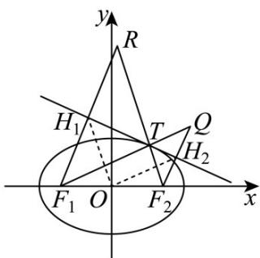

> [!faq]- 《专题01 椭圆的四大常考题型（高效培优专项训练）》官方解析
>
> > [!success]- **【答案】** ABD
>
> > [!note]- **【解析】**
> > 对于选项 A：设切线 l 上一动点为 P，
> >
> > 一方面根据椭圆定义得到 $PF_{1} + PF_{2}$ 2a
> >
> > 当且仅当点 P 在切点 T 时，取到等号；
> >
> > 另一方面，设右焦点 $F_{2}$ 关于切线l的对称点为Q，
> >
> > 设左焦点 $F_{1}$ 关于切线 l 的对称点为 R，
> >
> > 则 $PF_{1} + PQ$ 2a
> >
> > 当且仅当点 $F_{1}$ ，P，Q，三点共线时，取到等号；
> >
> > 所以 $F_{1}$ ，T，Q 三点共线，所以 $\angle F_{1}TH_{1} = \angle QTH_{2} = \angle F_{2}TH_{2}$ ，故选项 A 正确；
> >
> > 对于选项B：由前面分析得到 $\left|OH_2\right| = \frac{1}{2}\left|F_1Q\right| = a$ ，同理 $\left|OH_1\right| = a$
> >
> > 所以 $\left|OH_{1}\right|=\left|OH_{2}\right|$ ，故选项 B 正确；
> >
> > 对于选项C：举反例说明，如取切点 $T$ 在椭圆上顶点时，则 $\left|TH_1\right|\cdot \left|TH_2\right| = c^2$
> >
> > 而所给椭圆中 $b^{2}$ 与 $c^{2}$ 的大小不确定，故选项C不正确；
> >
> > 对于选项 D：设 $\angle F_{1}TH_{1} = \angle F_{2}TH_{2} = \theta$ ， $TF_{1} = m$ ， $TF_{2} = n$
> >
> > 所以 $\left|F_1H_1\right| = m\sin \theta$ ， $\left|F_2H_2\right| = n\sin \theta$ ，则 $\left|F_1H_1\right|\cdot \left|F_2H_2\right| = mn\sin^2\theta$
> >
> > 又在 $\Delta F_{1}TF_{2}$ 中， $4c^{2} = m^{2} + n^{2} - 2mn\cos (\pi -2\theta) = (m + n)^{2} - 2mn(1 - \cos 2\theta)$
> >
> > 化简得 $4c^{2} = 4a^{2} - 4mn\sin^{2}\theta$ ，即 $mn\sin^2\theta = b^2$
> >
> > 所以 $\left|F_{1}H_{1}\right|\cdot\left|F_{2}H_{2}\right|=b^{2}<a^{2}$ ，故选项 D 正确.
> >
> > 
> >
> > 故选 **ABD**.
