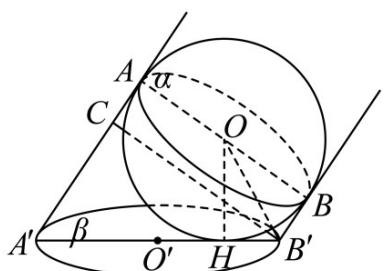
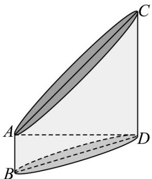
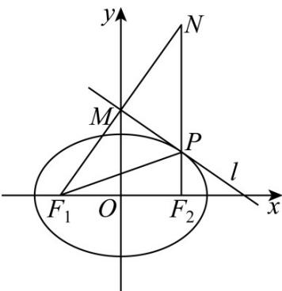
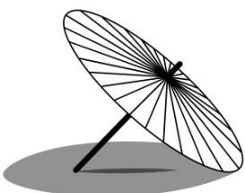
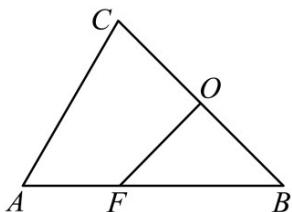

> [!faq]- 《专题01 椭圆的四大常考题型（高效培优专项训练）》官方解析
>
> > [!success]- **【答案】** A
>
> > [!note]- **【解析】**
> > 
> >
> > 设篮球半径为 $R$ ，显然平面 $ABB^{\prime}A^{\prime}\perp$ 平面 $\beta$ ，连接 $OH,OB^{\prime},OH\perp$ 平面 $\beta$
> >
> > 过 $B^{\prime}$ 作 $B^{\prime}C \parallel AB$ 交 $AA^{\prime}$ 于 $C$ ，则 $B^{\prime}C \perp AA^{\prime}, B^{\prime}C = AB$
> >
> > 于是椭圆长轴长 $2a = A'B' = \frac{B'C}{\sin\theta} = \frac{2R}{\sin\theta}$
> >
> > 在四边形 $ABB'A'$ 中， $\angle B'OH = \frac{1}{2} \angle BOH = \frac{\theta}{2}$ ，
> >
> > 令椭圆半焦距为 $c$ ，而 $0 < \theta < \frac{\pi}{2}$ ，则 $a - c = B'H = R\tan \frac{\theta}{2} = \frac{R\sin\frac{\theta}{2}}{\cos\frac{\theta}{2}} = \frac{R\cdot 2\sin^2\frac{\theta}{2}}{2\sin\frac{\theta}{2}\cos\frac{\theta}{2}} = \frac{R(1 - \cos\theta)}{\sin\theta} = a(1 - \cos \theta)$
> >
> > 解得 $\frac{c}{a} = \cos \theta$
> >
> > 所以该椭圆的离心率为 $\cos\theta$
> >
> > 故选：A
> >
> > 36. 嫁接是一种营养生殖方式，是植物的人工繁殖方法之一，即把一株植物的枝或芽接在另一株植物的茎或根上，使接在一起的两个部分长成一个完整的植株·已知某段圆柱形的树枝通过利用刀具进行斜辟，形成两个椭圆形截面，如图所示，其中 $AC$ ，BD分别为两个微面椭圆的长轴，且 $A$ ， $C$ ， $B$ ， $D$ 都位于圆柱的同一个轴微面上，AD是圆柱微面圆的一条直径，设上、下两个截面椭圆的离心率分别为 $e_1$ ， $e_2$ ，若 $\angle CAD = \frac{\pi}{4}$ ， $\angle ADB = \frac{\pi}{6}$ ，则 $\frac{e_1}{e_2}$ 的值是\_\_\_\_。
> >
> > 【答案】
> >
> > 
> >
> > 【答案】 $\sqrt{2}$
> >
> > 【详解】由题意可知 $AC = \sqrt{2}CD = \sqrt{2}AD$ ， $AD = \sqrt{3}AB$ ，
> >
> > 不妨设 AB = 1 ，则 $AD = \sqrt{3}$ ， $AC = \sqrt{6}$ ，BD = 2，如下图所示：
> >
> > 
> >
> > 所以上、下截面椭圆的离心率分别为 $e_1 = \frac{CD}{AC} = \frac{\sqrt{2}}{2}$ ， $e_2 = \frac{AB}{BD} = \frac{1}{2}$ 所以 $\frac{e_1}{e_2} = \sqrt{2}$
> >
> > 故答案为： $\sqrt{2}$
> >
> > 37. 古希腊数学家阿波罗尼奥斯所著的八册《圆锥曲线论（Conics）》中，首次提出了圆锥曲线的光学性质，其中之一的内容为：“若点 $P$ 为椭圆上的一点， $F_{1}$ 、 $F_{2}$ 为椭圆的两个焦点，则点 $P$ 处的切线平分 $\angle F_{1}PF_{2}$ 外角”根据此信息回答下列问题：已知椭圆 $C: \frac{x^{2}}{8} + \frac{y^{2}}{4} = 1$ ， $O$ 为坐标原点， $l$ 是点 $P(2, \sqrt{2})$ 处的切线，过左焦点 $F_{1}$ 作 $l$ 的垂线，垂足为 $M$ ，则 $|OM|$ 为（）A. $2\sqrt{2}$ B. 2 C. 3 D. $2\sqrt{3}$
> >
> > 【答案】A
> >
> > 【详解】如下图所示：
> >
> > 
> >
> > 延长 $F_{1}M$ 、 $F_{2}P$ 交于点 $N$ ，由题意可知 $\angle F_{1}PM = \angle NPM$ 又因为 $PM\perp F_1N$ ，则 $M$ 为 $F_{1}N$ 的中点，且 $\left|PF_1\right| = \left|PN\right|$ 所以， $\left|F_2N\right| = \left|PN\right| + \left|PF_2\right| = \left|PF_1\right| + \left|PF_2\right| = 2a = 4\sqrt{2}$ 又因为 $O$ 为 $F_{1}F_{2}$ 的中点，则 $\left|OM\right| = \frac{1}{2}\left|F_2N\right| = \frac{1}{2}\times 4\sqrt{2} = 2\sqrt{2}$
> >
> > 故选：A.
> >
> > 38. 油纸伞是中国传统工艺品，至今已有 $1000$ 多年的历史，为宣传和推广这一传统工艺，北京市文化宫于春分时节开展油纸伞文化艺术节·活动中将油纸伞撑开后摆放在户外展览场地上，如图所示，该伞的伞沿是一个半径为 $\sqrt{2}$ 的圆，圆心到伞柄底端距离为 $\sqrt{2}$ ，阳光照射油纸伞在地面形成了一个椭圆形影子（春分时，北京的阳光与地面夹角为 $60^{\circ}$ ），若伞柄底端正好位于该椭圆的焦点位置，则该椭圆的离心率为（）
> >
> > 【答案】
> >
> > 
> >
> > A. $2 - \sqrt{3}$ B. $\sqrt{2} -1$ C. $\sqrt{3} -1$ D. $\frac{\sqrt{2}}{2}$
> >
> > 【答案】A
> >
> > 【详解】如图，伞的伞沿与地面接触点 B 是椭圆长轴的一个端点，伞沿在地面上最远的投影点 A 是椭圆长轴的另一个端点，
> >
> > 对应的伞沿为 $C$ ， $O$ 为伞的圆心， $F$ 为伞柄底端，即椭圆的左焦点，令椭圆的长半轴长为 $a$ ，半焦距为 $c$
> >
> > 
> >
> > 由 $OF \perp BC, |OF| = |OB| = \sqrt{2}$ ，得 $a + c = |BF| = 2, \angle FBC = 45^\circ$ ， $|AB| = 2a, |BC| = 2\sqrt{2}$
> >
> > 在VABC中， $\angle BAC=60^{\circ}$ ，则 $\angle ACB=75^{\circ}$ ， $\sin75^{\circ}=\sin(45^{\circ}+30^{\circ})=\frac{\sqrt{2}}{2}\times\frac{\sqrt{3}}{2}+\frac{\sqrt{2}}{2}\times\frac{1}{2}=\frac{\sqrt{6}+\sqrt{2}}{4}$
> >
> > 由正弦定理得， $\frac{2a}{\sin75^{\circ}}=\frac{2\sqrt{2}}{\sin60^{\circ}}$ ，解得 $a=\frac{\sqrt{2}\times\frac{\sqrt{6}+\sqrt{2}}{4}}{\frac{\sqrt{3}}{2}}=1+\frac{1}{\sqrt{3}}$ ，则 $c=1-\frac{1}{\sqrt{3}}$ ，
> >
> > 所以该椭圆的离心率 $e = \frac{c}{a} = \frac{\sqrt{3} - 1}{\sqrt{3} + 1} = 2 - \sqrt{3}$ .
> >
> > 故选 **A**
